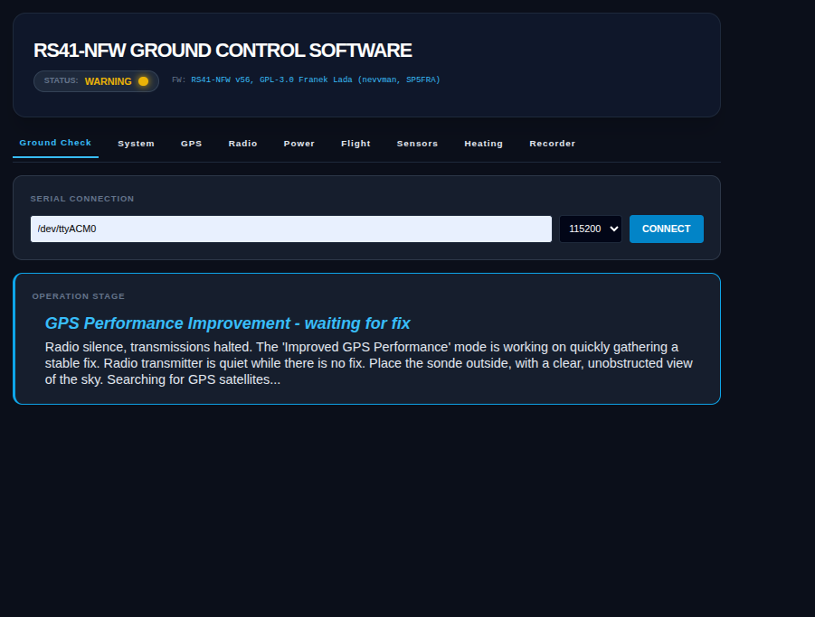
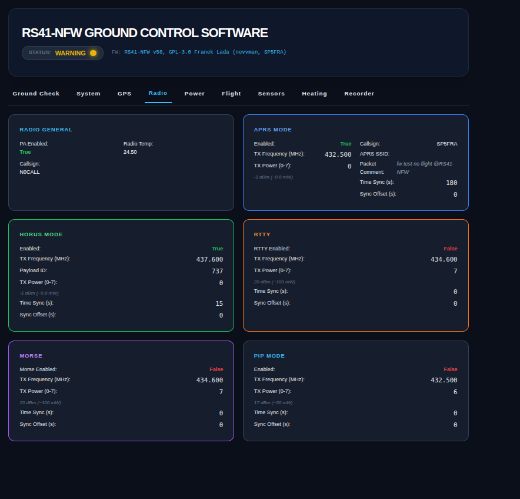
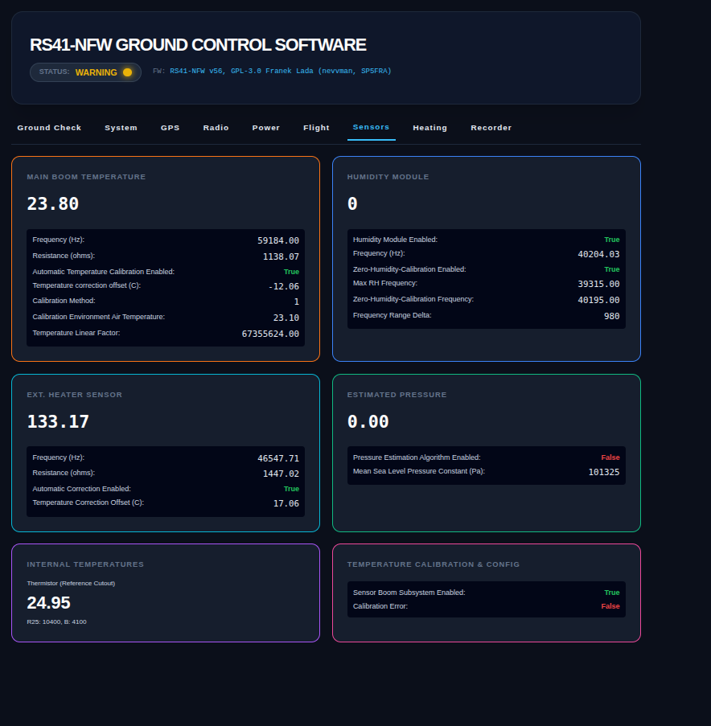

# RS41-NFW - Versatile, custom firmware for ALL revisions of Vaisala RS41 radiosondes
## **Vaisala RS41 New Firmware** (*RS41 Nevvman's Firmware*)  
**NOTE:** This firmware works with the **ALL** variants of RS41 radiosondes, with the new (2023 and 2025) ones too, bringing full hardware and software support with lots of features for everyone. More below.  
Vaisala some time ago began launching new RS41 sonde revisions, with new internal design. They can be recognized by a last digit of 4 or 5 of the PCB model (eg. `RSM414`, `RSM424`, `RSM425`). This firmware is an approach for reusing them as amateur devices for many different purposes. It brings full and thorough support for [all revisions](../hw/README.md#older-vs-newer---how-do-i-know-which-one-im-holding-now). 

* [RS41-NFW Firmware features](#rs41-nfw-firmware-features)
* [Terms of Use](#terms-of-use)
* [Radiosondes?](#radiosondes)
* [Installation guide](#installation-guide)
* [Firmware flashing](#firmware-flashing)
* [Firmware compilation](#firmware-compilation)
* [Firmware and device operation](#firmware-and-device-operation)
* [RS41-NFW Ground Control Software](#rs41-nfw-ground-control-software)
* [RSM414 hardware](#rsm414-hardware)
* [Firmware changelog](#firmware-changelog)
* [Authors and contributors to this branch](#authors-and-contributors-to-this-branch)
* [References](#references)
* [Final notes](#final-notes)

## RS41-NFW Firmware features
* **Full support for ALL** RS41 versions (eg. `RSM421`, `RSM412`, `RSM414`, `RSM424`, `RSM425`), including the old and new ones with the '4' at the end of the PCB model
* **For current, up-to-date list of featurse, please refer to the [firmware project file configuration options](./rs41-nfw_sonde-firmware/rs41-nfw_sonde-firmware.ino), where all features are available with thorough comments and guides.**
* Multiple, customizable transmission modes
    * [**Horus Binary 4FSK v3**](https://github.com/xssfox/horusbinaryv3)
        * One of the most efficient radio modes for HAB and other simple telemetry designs, allows for decoding of very weak signals
        * Multi-QRG operation (ability to specify second Horus one, user can modify the code easily to get as much QRGs as wanted on every mode)
        * User can specify any payload callsign without requesting for ID number, additional sensor fields can be sent easily. Decoder provided by Mark VK5QI.
    * [**Horus Binary 4FSK v2**](https://github.com/projecthorus/horusdemodlib/wiki)
        * One of the most efficient radio modes for HAB and other simple telemetry designs, allows for decoding of very weak signals
        * Multi-QRG operation (ability to specify second Horus one, user can modify the code easily to get as much QRGs as wanted on every mode)
    * APRS
      * 1200 baud, with 1200Hz and 2200Hz tones, achieved by FSK switching in a precisely tuned loop (very good performance)
      * Many config options, including HAB (PSTVC structure compliant with RS41ng) and WX station reporting formats, overlay symbol modifier, SSID, destination (`APZNFW` supported and decoded by SondeHub), digi, etc.
    * RTTY
        * Customizable 45, 75 and 100 baud rates, also other available
        * Customizable tone spacing as a multiplication of 270Hz, default 570Hz
        * Data bits and stop bits customizable (default 7N2)
        * Compliant with UKHAS format. Provided by OM3BC
    * Morse code (CW)
        * Customizable wpm speed and dot length
        * Compliant with UKHAS format
    * PIP
        * Beacon operation, transmitting short beep with a specified interval, which could be used as a foxhunting TX device
* Thorough support of RS41 hardware, including GPS, radio, power circuitry, heaters etc., timers ...and:
* Support for **onboard boom sensors**, including **temperature and humidity** sensors!
* Apart from the sensor boom, also Vaisala **RPM411** pressure sensor add-on board measurement support!
* Detailed in-built **debugging** features via LED status and serial messages
* Onboard **button** allowing user to shutdown the sonde and change different operation modes
* **Safety features**, including GPS watchdog and position improvement (these two nicely improve flights in environments with interference/noise), battery voltage protection, sensors defrosting and condensation prevention, system reset watchdog
* Support for extending hardware capabilities, including **XDATA port**
* **Power saving** features, including GPS power management (together with powersaving modes and OFF mode for stationary use cases), flight modes, after-landing powersave and advanced heating algorithms.
* **User-friendly** firmware and IDE allows users to easily customimze the device operation
* Weather station mode, supporting APRS WX report, constant coordinates
* Fox hunting mode, with CW and FM audio beacons
* Flight controling algorithms. Ability to rapidly send packets when below set altitude. Data analysis and debug sent via APRS extended packets every set interval
* Automatic calibration modes for temperature and humidity sensors on the silver boom, ground-check procedures, humidity module reconditioning. Ability to further improve accuracy by manually calibrating the readings
* Dedicated **RS41-NFW Ground Control Software**, for simple and detailed pre-flilght things
* And many more

## Terms of Use
**RS41-NFW** project (author - Franek *nevvman SP5FRA*) is released under **GNU GPL-3.0 license**. This software is **open source** and **free to use for amateur projects**, **which cannot lead to profit** in any kind. This excludes usage of this firmware as a commercial product. **For commercial use, please contact me**. 
The creator of this project isn't at all responsible for any kind of harm made by devices operated with these instructions. Follow your local law about radio transmissions and balloon flights. Altough the firmware **tested successfully** on several dozen of flights, keep in mind that it is still a *hobbyst project*.

## Radiosondes?
These small electronic devices are used by weather instututes to perform atmospheric sounding and high altitude measurements, up to the stratosphere (HAB - high altitude ballooning). After the flight, usually they are *meaningless* for the launch company, so they can be collected by people (verify this according to the certain launch site). This acvitivty is called *radiosonde hunting*  
The most simple and costless way of collecting radiosondes is to track them on sites like [radiosondy.info](https://radiosondy.info/) or [SondeHub](https://sondehub.org/) (previously HabHub).  
Another, more advanced way is to hunt them with radio receivers. Most of them transmit on the EU 400-406 MHz radiosonde band, near an amateur 70cm band. You can do that by a simple direction finding with a directional (for example Yagi) antenna and a handheld receiver.   
But, currently the best way is to utilize a Software-Defined Radio (SDR, for example an RTL-SDR v3 / v4, Nooelec SDR, RSP1 or HackRF) together with a 70cm band antenna (dipole should work for sondes in air as far as 100km, the best is a high gain Yagi, with this setup you could easily hear a radiosonde hundreds kilometers away) and a specialized software for a computer, laptop or a Raspberry Pi. On the internet you will find lots of tutorials for receiver setup, tracking and hunting of them. Also, mobile tracking devices gain popularity, such as Lilygo TTGO boards flashed with RDZsonde (suggested) or MySondy (alternative to rdz) firmwares.   
**Kind note:** After each hunt, either successful or not, please change the radiosonde status on the previously mentioned trakcing sites. This will not only let many people save on fuel and patience, but also allow everyone to take a look on sounding statistics and other things. On the most simple site for tracking (SondeHub) you don't even need to create an account to change the sonde status, which only takes a minute.  
*It's an unpleasant feeling, when after driving dozens of kilometers in search for radiosonde you come across an empty field without any balloon traces.*  
For more details about HAB and sonde hunting, please look on google and social media, there is a ton of valuable content.

## Installation guide
A thorough, detailed project guide is available at the links below. 
**If you want to fully utilize all capabilities of this firmware**, please, read the documentation in the following header order:

## Firmware flashing
See: [fw/FLASHING.md](./fw/FLASHING.md)

## Firmware compilation
See: [fw/COMPILE.md](./fw/COMPILE.md)

## Firmware and device operation
See: [fw/OPERATION_MANUAL.md](./fw/OPERATION_MANUAL.md)  
**Note:** this manual is outdated, please refer to new improved code comments, as they are up-to-date resource full of information about the functions of this project.

## RS41-NFW Ground Control Software
Advanced and user friendly webGUI created in Python.  
See: [./rs41-nfw_ground_control_software/README.MD](./rs41-nfw_ground_control_software/README.MD)

  
   
  

## RSM414 hardware
See: [hw/README.md](./hw/README.md)

## Firmware changelog
* `v62` - Redefined sensor stalk measurements - now using **hardware timers** and completely new correction algorithms. Much faster and **much more precise** readout, with **measurement noise absent** now. Humidity measurement is now done via actual sensor capacitance measurement, which provides more accurate readings, especially high in the atmosphere. Humidity measurement should now be *somehow accurate* with great claibration (temperature is very accurate), due to new temperature as well as heating correction algorithms. New pressure estimation algorithm, based on the barometric formula. Fixed NTC thermistor R25 and beta values. Rewritten scheduler, addressing non-consistent intervals. Data recorder frames are now send via Horus V3 (apart from APRS), more in the code comments of `dataRecorder`. Pressure readings from RPM411 are now passed through a responsive, light Kalman filter. Device status and fault detection improvements. Fixed morse and RTTY payload creation issue, where comment with lower-case symbols could lock the uC. Quicker zero-humidity check and optimised calibration temperature. Minor fixes. Docs.
* `v61` - Full support for original Vaisala **RPM411** pressure sensor add-on board.
* `v60` - Improved APRS timings and baud rate consistency, with help of Wolfgang DF7PN and Ayar HB9EVW.
* `v59` - Horus Binary V3 bugfix for RSM4x2 revisions, APRS WX wind reporting correction, docs.
* `v58` - **Horus Binary 4FSK V3** support for **all** revisions of sondes. Horus Binary v2/v3 preamble improvements. Code size optimization for old models. Users aren't now required to download libraries in Library Manager - **libraries are now provided** with the downloaded sonde-firmware directory, and work out of the box! [Issue 37](https://github.com/Nevvman18/rs41-nfw/issues/37).
* `v57` - New APRS telemetry format and tocall, with much more data sent, bugfixes.
* `v56` - Introducing **Scheduler** - new CPU time management function. Introducing [**RS41-NFW Ground Control Software**](./rs41-nfw_ground_control_software/README.MD), which guides you through different ground check stages and lets you inspect a lot(!) of flight parameters and sensor data. Improved sensor readout - much faster, more acurate, and with slightly reduced oscillations. Support for infinite number of cycling Horus and APRS frequencies. Redefined heating algorithms - now based on precise PID control and PWM, also with new in-flight contrl, allowing for sensor defrosting, while having no impact on the radings. New humidity correction algorithms, based on empirical data from many previous flights. Faster program operation. New LED status messages. Redefined documentation - operation manual markdown file became outdated, but new detailed code comments are here.
* `v55` - Si4032 radio now consumes 10-15mA less current than before, due to a misunderstanding of operation stages, allowing now to sleep properly between transmissions. Ability to specify TX power in each mode. Removed power save mode which changed interval and power below a certain altitude, which was a clone of a newer feature called `lowAltitudeFastTx`. Ability yo specify constant altitude when stationary use with no GPS. Others. + support of the newest `RSM425` boards.
* `v54` - power OFF routine modification, making the procedure status more clear. APRS temperature reporting length improvement.
* `v53` - timing improvements down to milliseconds, with help of Bernd DL1XH. More talkative UART debug messages.
* `v52` - heating bug with time management, APRS format improvement
* `v51` - small corrections and improvements
* `v50` - issue [20 fix](https://github.com/Nevvman18/rs41-nfw/issues/20) corrected description. Improved accuracy of both temperature and humidity reading based on empirical tests. Added optional reconditioning phase before zero-humidity check. Improved reference area heating and humidity sensor heating control algorithms, allowing to run more smoothly and precisely. More customization options.
* `v49` - issue [18 fix](https://github.com/Nevvman18/rs41-nfw/issues/18). Si4032 temperature measurement change, to accurately measure negative temperatures. Option to calibrate temperature sensors using: manual offset setting, automatic calibration with entered air temperature and automatic calibration based on PCB temperature. Sensor boom diagnostics improvement. Vertical velocity calculation algorithm returns 0 if no fix. Default settings changed slightly. Stability and code structure improvements. Repo versioning fix.
* `v48` - RTTY format, timing and customization bugfix and enhancements by OM3BC ([issue 15](https://github.com/Nevvman18/rs41-nfw/issues/15)), firmware crash fix ([issue 16](https://github.com/Nevvman18/rs41-nfw/issues/16)), APRS coordinate bugfix by KB8RCO ([issue 17](https://github.com/Nevvman18/rs41-nfw/issues/17)). Improvement in APRS timings.
* `v47` - watchdog bugfix, which could to a sudden restart of GPS during flight (once every 30 minutes), due to a wrong condition check. Fixed and no problem.
* `v46` - GPS bugfix, previous flights shouldn't have been affected
* `v45` - pressure estimation can now be enabled/disabled. Also added what was forgotten - user input of sea level pressure.
* `v44` - humidity readings accuracy improvement, temperature compensation improvement, GPS abnormalities detection with sending to ground in dataRecorder APRS extended packets, HDOP value in dataRecorder packets, other minor improvements
* `v43` - minor improvements
* `v42` - dataRecorder functionality improvement, which additionally sends power of all 3 heaters, temperatures of radio and references area and battery voltage in mV
* `v41` - PWM humidity sensor heating, just like in the Vaisala firmware, which maintains the humidity module temperature ~5K above air temperature (by default). References heating improvement, which maintains the temperature more stabily and using 3 different power levels for power saving and efficiency. Improved calibration function based on variable heating power, speeding up the process. Pressure estimation (like in RS41-SG models?, here based on altitude, temperature and RH) sent via Horus and APRS WX packets. APRS coordinates conversion script adjustment based on RS41ng function. 
* `v40` - now the `referenceHeating` option works like in the Vaisala firmware, maintaing temperature around 18*C.
* `v39` - performance improvements, minor changes
* `v38` - bugfix for delay variable initialization, which could lead to overflow if set at 65 seconds or higher
* `v37` - fox hunting mode, which can transmit a melody over NFM, CW pip, CW morse with additional message contents of location below voltage warning and battery voltage reporting, this mode operates in as low power consumption as possible (measurement circuits disabled, heaters disabled, GPS disabled, radio sleeping between transmissions). The gpsSpeed value in Horus v2 payload is now reported in km/h (instead of m/s as before). Small changes in startup and calibration procedure.
* `v36` - changes in button operation algorithm - user can select between completely disabled button functions, sonde shutdown on button press or extended mode, which allows to change some parameters of the sonde. The button operation is available now throughout the whole operation of the sonde, in some limited areas (like calibrartion) the button can shutdown the sonde now.
* `v35` - fixed boom calibration issue, which could lead to worse humidity compensation. Enhanced defrosting algorithm, that doesn't impact the readings.
* `v34` - support for onboard humidity sensor reading (not the most accurate method, but gives reasonable readings with easy use). Humidity module calibration modes and auto-compensation (some parts of it known as zero-humidity check). Defrosting features. Reference resistors warming to maintain their temperature. Automatic temperature compensation for humidity module sensor readings. Depreciated oscillator heating capabilities - RTTY isn't widely used, especiallu at 75-baud and the option was very power hungry - now the resistors are used like from factory, to slightly warm up the reference resistors and capacitor.
* `v33` - added option to disable the button operation. New dataRecorder feature, that saves most important statistics from flight and transmits them in APRS comments once for a specified time (by default every 10 minutes). Flight computing abilities, that measure flight parameters (min/max values; flight, burst and landing phase detection, etc.). New ultraPowerSaveAfterLanding feature, that lowers the power consumption as much as possible 30 minutes after landing (GPS is fully OFF, sensors and peripherals get disabled) and transmits the last coordinates every 10 minutes via Horus and APRS (+ dataRecorder statistics). Added a watchdog that resets the CPU after specified time (2 weeks by default) to protect from overflowing.
* `v32` - added APRS 2 reporting modes - normal HAB tracking format and WX report format for weather station use. GPS operation modes - disabled, max performance, power saving; utilizing automatic powersaving switching to ensure best power consumption with reliable tracking. New feature, which transmits Horus packets as fast as possible (6s) at low altitudes (< 1km) for specified time when descending, to ensure that the lowest frame is captured. RTTY and Morse TX format now compliant with UKHAS formatting.
* `v31` - added APRS support (not copied), GPS no-fix timeout watchdog (resets the chip if it can't get a fix for long enough), GPS performance improvement in position gathering, 2nd Horus TX frequency (with alternating mode and repeating packest), code clean-up, other small fixes and preparations for next releases
* `v30` - added vertical velocity calculation and reporting via Horus v2. New and more accurate synchronization of delays between TX modes, fixnig issue were the delay was doubled in certain conditions.
* `v29` - final fix for GPS dynamic model setting - both old and new boards tested (new tested in-flight, old checked through u-center and will be tested in-flight soon). GPS tracking should be now trustworthy (still no verification mechanism, but shouldn't be for now a big concern).
* `v28` - full compatibility of default Horus v2 payload format with RS41ng default format. Detection of external power supply (for example via programmer) disabling button functionality to prevent unpredictable device operation.
* `v27` - support for sensor boom - accurate readings of external temperature and humidity module temperature (humidity measurement not supported **yet**), Horus v2 format corrections (default payload uses the same format as RS41ng).
* `v26` - added missing feature on older RS41 (`RSM4x1`, `RSM4x2`) sondes - reference heating, which is activated by Si4032 GPIO pin.
* `v25` - powerSave mode, featuring automaticaly-adjustable TX power and transmission intervals, based on the altitude. Changed default values of the firmware.
* `v24` - some improvements in the GPS Dynamic Model setting, support for both old and new sondes, simple VALSET & VALGET validation mechanism for the new sondes. The Airborne 1G mode is still experimental!
* `v231` - fix issues of the previous *release v2.3*, thanks to [(still) this issue #3](https://github.com/Nevvman18/rs41-nfw/issues/3). Changed OIF411 data interpretation according to the operation manual (raw data division).
* `v23` - added experimental uBlox GPS Airborne 1G Dynamic Model selection via UART of the module, thanks to [this issue #3](https://github.com/Nevvman18/rs41-nfw/issues/3)
* `v22` - support for OIF411 ozone sounding system (including decoding the ozone info and transmision to ground), XDATA port mode selection (disabled, debug UART, XDATA UART), easy method of changing the payload-ID in Horus v2 mode, height activated oscillator heater
* `v21` - added support for old RS41 models (`RSM412`)
* `v20` - initial public release, releases before this were never published

 

Incoming features:
* Document the hardware of `RSM425` revision - it works flawlessly with the RS41-NFW, however, I don't have one yet that I can study on. **If you have one, please contact me.**

## People responsible for this project
* Authors
  * **Franek SP5FRA 'nevvman'**
* Contributors - speical thanks to:
  * My dad, for his help in catching the radiosondes and suggestions
  * Erik PA0ESH - helped with lots of issues
  * Mark VK5QI - for help with GPS settings, Horus and sensors. New Horus v3 decoder.
  * zanco PE2BZ - for a test flight and other notes
  * Ludwik SP6MPL - for a few flights and big help in development
  * Mateusz SP3WRO - for test flights, kind words and help in development, and also his team
  * [radioszynka blog](https://radioszynka.pl/) team - for article about this project
  * Mark PC9DB - TX formats etc.
  * KB8RCO - big thread about APRS (also code to fix coordinate issue), WX use and others
  * whallman DF7PN - much help in discussions, frameCounter fix
  * Damian SQ2DEF and his team - SQ6KXY, Paweł, Lechu, McXander, wprzyb, Michał, Hubert...
  * obi7zik - thread about GPS power mode issue
  * OM3BC - big help in getting the RTTY to finally have a proper format and timings
  * maxkup14 - suggested accuracy of sensor measurements is affected by GPS (to be investigated) and successfully tested the RS41-NFW with 2025 `RSM425` revision!
  * People from *Radiosondy Polska* group - Jarosław, Wojtek... - kind words in a local group argument

## References
* [*RS41ng* - inspiration for this project (NFW is not a fork of any kind (too much differing to be called so), just a few pieces of it's code structure is used here)](https://github.com/mikaelnousiainen/RS41ng) 
* [**RS41ng - issues discussion about new models and supporting them**](https://github.com/mikaelnousiainen/RS41ng/issues/92)
* [*RS41HUP* - also inspiration](https://github.com/darksidelemm/RS41HUP) 
* [*radiosonde_hardware* - made reversing the new version easier](https://github.com/bazjo/radiosonde_hardware) 
* [*Horus Binary* - awesome HAB radio protocol](https://github.com/projecthorus/horusdemodlib) 
* [*Arduino APRS*](https://handiko.github.io/Arduino-APRS/) library, partially utilized here to create APRS messages
