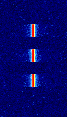
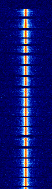
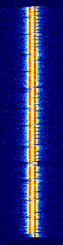
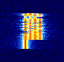

# RS41-NFW Operation manual

* [Firmware configuration](#firmware-configuration)
  * [Recommended settings](#recommended-settings)
  * [Sonde PCB version](#sonde-pcb-version)
  * [IO assignment, dependencies](#io-assignment-dependencies)
  * [Radio signals config](#radio-signals-config)
  * [Other operation config](#other-operation-config)
* [Device operation](#device-operation)
  * [Starting the radiosonde](#starting-the-radiosonde)
  * [Device debug status and LED lights](#device-debug-status-and-led-lights)
  * [Button operation](#button-operation)
  * [Radio signals operation](#radio-signals-operation)
    * [PIP](#pip)
    * [Morse](#morse)
    * [RTTY](#rtty)
      * [Standard RTTY message format](#standard-rtty-message-format)
      * [Short RTTY message format](#short-rtty-message-format)
    * [Horus Binary](#horus-binary)
      * [Default Horus message format](#default-horus-message-format)
  * [XDATA port operation](#xdata-port-operation)
  * [Power management](#power-management)
    * [powerSave features](#powersave-features)
  * [Heater algorithm](#heater-algorithm)

## Firmware configuration
To configure the firmware, open the .ino project file in the IDE. <br>
Configuration options are located in definitions on the first ~100 of lines.


### Recommended settings
The firmware by default is set with initial settings. For the first-time operation user should change the following: 
* Sonde version
* `CALLSIGN` or `horusPayloadId`
* `radioPwrSetting`
* Battery power settings
* TX mode and frequency settings - recommended is only the Horus v2 mode at the 70cm amateur band - this provides the best range and speed capabilities.
These settings are explained below.

### Sonde PCB version
The crucial part of the initial configuration is to set the appropriate sonde hardware version. Not setting the correct version will either cause compilation errors or result in a non fully-working device.
```cpp
#define RSM4x4 //new pcb versions
//#define RSM4x2 //old pcb versions, also rsm4x1
```
Uncomment the right definition to set it.

### IO assignment, dependencies
For the standard firmware operation, you shouldn't need to change them. <br>
Project dependencies are defined on the first lines in the `//===== Libraries and lib-dependant definitions` section. <br>
The system IO assignment is available in the `//===== Pin definitions` section - from there you can define the pin assignemnts and names to refer in the later code. <br>
In the `//===== Interfaces` part, the communication interfaces are set-up, like SPI class for radio IC and USART interfaces.

### Radio signals config
This is the first interesting part that a user should customize. It is located at the section `//===== Radio signals config`.  [More about radio here](#radio-signals-operation)<br><br>

```cpp
#define CALLSIGN "N0CALLN0CALL"  //max 10 chars long, currently used for rtty
#define PREAMBLE "AA"            //max 2 long
```
`CALLSIGN` should be changed to the user-specific one. Maximum recommended length is 10 characters, if your desired callsign is shorter, then pad them with spaces before the callsign.<br>
`PREABMLE` is a 2-byte long part of the text that is used in the RTTY mode. If the TX signal is weaker, some programs may have difficulties detecting the carriers on the first bit, so the preamble is transmitted first. <br>

```cpp
int defaultRadioPwrSetting = 7; //default TX power, also see lines down below; 0 = -1dBm (~0.8mW), 1 = 2dBm (~1.6mW), 2 = 5dBm (~3 mW), 3 = 8dBm (~6 mW), 4 = 11dBm (~12 mW), 5 = 14dBm (25 mW), 6 = 17dBm (50 mW), 7 = 20dBm (100 mW)
int powerSaveRadioPwrSetting = 5; //radio TX power for power save feature - deterimnes the TX power level at which the sonde will be transmitting when certain altitude (powerSaveAltitude), set to -1 to disable the powerSave features applying to the TX power. If this option is activated, the button logic for changing the radio power won't work
```
These are the settings for configuring the radio transmission power (0-7). The default value is `defaultRadioPwrSetting`. There is also a `powerSaveRadioPwrSetting` value, which is used when the [powerSave](#powersave-features) features are enabled, to disable, set it to -1.


```cpp
bool enableAddData = false;      //rtty-only mode, when false, the additional-data space is filled with zeros
```
`enableAddData` RTTY-only and morse-only modes, has currently no use, in future when additional sensor support will be available, this part will be filled with the additional sensor data. Currently, setting to false fills the space with zeros. <br>

```cpp
bool pipEnable = false; //pip tx mode
float pipFrequencyMhz = 434.5; //pip tx frequency
int pipLengthMs = 1000; //pip signal length in ms
int pipRepeat = 3; //pip signal repeat count in 1 transmit group
```
`pipEnable` - this enables the PIP mode. It's frequency can be set using `pipFrequencyMhz`, the `pipLength` in ms determines the pip carrier length and `pipRepeat` says how many times to repeat the signal in one TX cycle. <br>

```cpp
bool morseEnable = false; //morse tx mode
float morseFrequencyMhz = 434.65; //morse tx frequency
int morseUnitTime = 40;  //ms
```
Morse can be enabled by `morseEnable` boolean. The frequency is set by `morseFrequencyMhz` and dot length in ms is set by `morseUnitTime`. <br>

```cpp
bool rttyEnable = false; //rtty tx mode
bool rttyShortenMsg = false; //false- all data, true - without preamble, time, speed and adddata
float rttyFrequencyMhz = 434.78; //rtty tx frequency
int rttyBitDelay = 22000;  //22000 ~= 45bdrate, 13333 ~= 75bdr
#define RTTY_RADIO_MARK_OFFSET 0x02 //for space offset set to 0x01, the rtty tone spacing will be: 0x02 - 270Hz spacing, 0x03 - 540Hz spacing | SPACING OTHER THAN 270HZ DOES NOT WORK (at lesast on my tests, will check later)
#define RTTY_RADIO_SPACE_OFFSET 0x01 //usually set to 0x01
```
This is a more advanced TX mode - radioteletype. It can be enabled with `rttyEnable`, it's frequency is set with `rttyFrequencyMhz`.<br>
Transmission baud rate is determined by the `rttyBitDelay` value and indicates the delay in microseconds used after each bit begins. For baud rate 45 set the delay to 22000 and for the 75 baud - 13333.<br>
The message format is determined by the `rttyShortenMsg`. This setting is explained further down in the [radio operation](#radio-signals-operation).<br>
`RTTY_RADIO_MARK_OFFSET` and `RTTY_RADIO_SPACE_OFFSET` can determine offset values written to frequency offset registers of the radio chip. If you don't want to customize the RTTY shift, leave this at default. In some tests, there was an issue where offsets larger than 1 (0x02 - 0x01 = 1[base10] -> 270Hz) made errors in RTTY transmissions. <br>

```cpp
bool horusEnable = true; //horus v2 tx mode
float horusFrequencyMhz = 434.74;
unsigned int horusPayloadId = 256;
int horusBdr = 100;
```
This is the best transmission mode to use. Enabled via `horusEnable`, frequency set with `horusFrequencyMhz`, the baud rate is set with `horusBdr`, with 100 bdr recommmended. The payload-ID setting can be changed with `horusPayloadId`, which is described [in the guide below](#horus-binary-v2).<br>

```cpp
bool bufTxEnable = false; //alpha state! mode
float fskFrequencyMhz = 436; //txBuf tx frequency
```
This mode is currently not supported - it was created during tests to apply a FSK/GFSK modulation with data transmitted at higher rates. Should remain false unless under development. <br>

```cpp
bool radioEnablePA = false;  //default tx state
bool radioSleep = true; //lowers power consumption and recalibrates oscillator (drift compensation)
int defaultModeChangeDelay = 0; //in milliseconds, 0 - disable, 0<delay<2000 - standard delay, 2000<delay - delay + radio sleep mode and recalibration (if radioSleep enabled); default delay between radio transmission modes
int powerSaveModeChangeDelay = 5000; //as above, but activates when the powerSave is ON, set to -1 to disable changing of the transmission delay above powerSaveAltitude
```
These are the radio power management settings.<br>
`radioEnablePA` enables RF stage power amplifier to start sending signals. If you want the sonde to start transmitting signals immediatly after power ON, set this to true. If set to false, the PA can be enabled with a button, described later.<br>
`radioSleep` allows radio to go to sleep mode, which lowers the power consumption in-between transmissions, by turning OFF unnecesary IC components. Should be true unless you encounter any problems. <br>
`defaultModeChangeDelay` sets the delay in ms between transmissions. If set to 0 it means that the sleep is disabled and the transmissions occur as fast as possible, if enabled and the delay is under 2000msmit just waits in-between the modes, and if the delay is over 2s it also puts the radio to sleep in-between transmissions to lower the power consumption. The additional `powerSaveModeChangeDelay` variable is used when the [powerSave features are enabled](#powersave-features), to disable it, set to -1. <br>

### Other operation config
This is the part that sets other operation variables that weren't mentioned earlier. It is located under the `//===== Other operation config` section in the project file.<br>

```cpp
bool ledStatusEnable = true;
int ledAutoDisableHeight = 1000; //height in meters above which the status LEDs get disabled
```
`ledStatusEnable` enables the LED to show device status messages. The LEDs can be automatically turned OFF when the payload starts flying, by setting the altitude threshold with `ledAutoDisableHeight`.<br>

```cpp
const int xdataPortMode = 0; //0 - disabled, 1 - debug uart, 2 - i2c (NO implementation now), 3 - xdata sensors (oif411)
```
This setting changes the XDATA port operation mode. This expansion port is described [here](#xdata-port-operation), with all of it's functions that can be set. This setting replaces the old `xdataDebug` variable, used in previous firmware versions. <br>

```cpp
float vBatWarnValue = 2.5; //battery warning voltage
float vBatErrValue = 2.3; //error voltage
float batteryCutOffVoltage = 0; //good for nimh cell life, below 0.8V per AA cell the damage could occur
```
This sets different battery voltage settings.<br>
`vBatWarnValue` sets the voltage warning threshold, `vBatErrValue` sets the voltage error threshold and `batteryCutOffVoltage` determines at which voltage the radiosonde should automatically power OFF to protect the batteries (read your battery safety instructions and set this value according to it's safety measures!). By default, it is set to 0V to ensure that the full capacity of the battery is used. <br>

```cpp
int ovhtWarnValue = 45; //overheating warning
int ovhtErrValue = 55; //overheating error
```
These settings set the warning and error thresholds for overheating messages. This protects the batteries when the device is exposed to heat, for example by laying on the sun for too long. **Note:** this safety feature gets disabled if the built-in heater is enabled and the heater uses it's own safety rules. <br>

```cpp
int gpsSatsWarnValue = 4; 
```
`gpsSatsWarnValue` determines the warning threshold for GPS satellite visibility. <br>

```cpp
bool ubloxGpsAirborneMode = true; //sets the uBlox GPS module to the Airborne 1G Dynamic Model, which should prevent from loosing fix above 18km altitude
```
`ubloxGpsAirborneMode` - if true, on startup sends raw bytes to the GPS. This sets the Dynamic Model setting to the Airborne 1G mode, which should prevent the GPS from losing fix above around 18km of height. <br>

```cpp
int refHeatingMode = 0; //0 - off, 1 - auto, 2 - always on
int refHeaterAutoActivationHeight = 0; //set to 0 to disable auto heater enable above set level, if other than 0 then it means height above which the heater gets auto enabled
unsigned long heaterWorkingTimeSec = 600; //heater heating time
unsigned long heaterCooldownTimeSec = 3; //heater cooldown time after heating process
int autoHeaterThreshold = 6; //auto heater temperature threshold, WARNING! If rtty used baud is faster than 45bdr, the threshold should be at 14*C to prevent the radio from loosing PPL-lock, best would be even to set the heating to always on. If only horus mode is used, it is not mandatory, altough for standard flights that dont require more than 12h of operation the 6*C is advised for defrosting and keeping the internals slightly above ice temperature.
int refHeaterCriticalDisableTemp = 70; //heater critical temp which disables the heating if exceeded
int refHeaterCriticalReenableTemp = 65; //heater temperature at which heating gets re-enabled after being cut down due to too high temperature
```
These are the heater settings. The heater operation is described below or by clicking [here](#heater-algorithm). The settings should be self-explanatory, like all the previous ones. <br>

```cpp
int gpsNmeaMsgWaitTime = 1200; //waiting time for gps message
```
The `gpsNmeaMsgWaitTime` in ms sets the time that the device will wait for the GPS UART message to come. For a standard 1Hz GPS, it should be set somewhere between 1100ms and 1500ms, depending on the GPS internal refresh rate settings.

```cpp
int oif411MsgWaitTime = 1200; //waiting time for oif411 message
```
The `oif411MsgWaitTime` in ms sets the time that the device will wait for the XDATA OIF411 message to come. It usually sends data in 1s intervals, so something around the 1200ms does the trick.

```cpp
int powerSaveAltitude = 3000; //altitude in meters above which the powerSave features start to occur (currently, TX power is lowered from defaultRadioPwrSetting to powerSaveRadioPwrSetting and the transmision interval is changed from modeChangeDelay to powerSaveModeChangeDelay), set to -1 to completely disable all powerSave features
```
`powerSaveAltitude` defines the altitude above which the sonde activates the powerSave mode. [Operation descibed here](#powersave-features).


```cpp
#define R25 10400  // 10k Ohms at 25°C thermistor 
#define B 4295     // Beta parameter calculated thermistor
```
These settings change the onboard thermistor characteristics, values were calculated for the default hardware and shouldn't be changed, unless the thermistor reading differs significantly from the real temperature. <br>

**Note:** The later definitions are system-only and shouldn't be changed by user.


## Device operation

### Starting the radiosonde
The radiosonde can be turned ON either by:

* Shortly pressing the button - refer to [Button operation](#button-operation) and [LED status](#device-debug-status-and-led-lights)
* Sending 13.56MHz carrier to the NFC coil - you can simply bring the back of your NFC-enabled smartphone closely to the bottom part of the sonde, near the button and LEDs

### Device debug status and LED lights
Immediately after pressing the button, during the setup function, the LEDs light up in the following debug order:

```
        Start   |  ......   | Setup complete
RED     ++--    |  ===      | ----------
GREEN   --++    |  ===      | +----+----

Plus (+) is equiv. to LED ON for 50ms, minus (-) means LED OFF for 50ms, (===) means operations in background
```

<br>

Device debug states, LED colors and conditions, during normal device operation:
* OK - continuous green light
  * If no valid warning or error, ok is true
* Warning - continuous orange light (both red and green make orange-like color)
  * `vBatErrValue` < Battery voltage < `vBatWarnValue`
  * `ovhtErrValue` < Thermistor temp. < `ovhtWarnValue`
  * GNSS satellites < `gpsSatsWarnValue`
* Error - continuous red light
  * Battery voltage < `vBatErrValue` < `vBatWarnValue`
  * Thermistor temp. < `ovhtErrValue` < `ovhtWarnValue`
* Undefined - continuous orange light
  * If 2 error levels happen simoultaneously (for example warn and error), this sets the status to undefined, which should never happen

<br>

LED status lights can be permamently turned OFF by defining `ledStatusEnable = false`. LED status lights turn OFF itself above 3000m to save the power.

The LEDs also change their status when the button modes are being selected, which is described in [Button operation](#button-operation).

The device also contains an 8 bit unsigned value called `deviceDebugState` which determines the device status and is sent via one of the Horus v2 additional packets. It is calculated using the following formula:
`deviceDebugState = statusNum + heaterDebugState`
<br>

The statusNum is determined by the status state:
* OK -> `statusNum = 0`;
* Warning -> `statusNum = 100`
* Error -> `statusNum = 200`

The deviceDebugState contains a failsafe that when it overflows the `uint8_t` range, it sets to `249`.

The `heaterDebugState` calculation is described in the [Heater algorithm](#heater-algorithm).


### Button operation
User can change different opeartion variables by using the on-board button while the device is ON.<br>

The button contains a page-like setting system, with pages from 1 to 7, whereas each page can be recognized by a 500ms GREEN-RED LED cycle. Entering a page is done by holding the button until the desired page number is selected, and then by releasing the button at this desired page number:
* Page 1 - `empty`
* Page 2 - `radioEnablePA`. Green blinks 2 times for true, red 2 times for false.
* Page 3 - `radioPwrSetting`. Green blinks 3 times for 100mW (7 max), red 3 times for 2mW (0 min). *annotation below*
* Page 4 - `rttyEnable`. Green blinks 4 times for true, red 4 times for false.
* Page 5 - `rttyShortenMsg`. Green blinks 5 times for false, red 5 times for true.
* Page 6 - `refHeatingMode`. Green blinks 6 times for OFF(0), orange 6 times for AUTO(1) and red 6 times for ALWAYS-ON(2).
* Page 7 - `SHUTDOWN`. If button is held to this page the red LED comes ON for 3 seconds and then the sonde is turned OFF.

For example, changing the page 3, with default configured value of 100mW, changing the radio power to 2mW would look like this in a sequence:

```
        *btn-hold* -----> *btn-released*
        | page1 | page2 | page3 |   |2mW confirm|   |continuing operation...
RED_____----++++----++++----++++____------------    _______________________
GREEN___++++----++++----++++----____++--++--++--    _______________________
```
<br>

`radioPwrSetting` annotation - this setting cannot be changed via the button when the powerSave features for the radio TX power are enabled (when the `powerSaveRadioPwrSetting` != -1). Tbe case is indicated with the RED led glowing for 500ms, which means that the operation didn't end successfully (radio power not changed).

### Radio signals operation

The radio modes are switched in cycles. Each cycle contains a transmission with each mode. Each transmission in one of the modes can be separated from the other with a defined `modeChangeDelay`, described above.

#### PIP
<p align="center">
<br>
</p><br>

This is an unmodulated carrier signal with no information carried. It can be used as beacon to show the presence of the transmitter, for example used in fox hunting.


#### Morse
<p align="center">
<br>
</p><br>

This is a single carrier signal that sends data using short RTTY payload message format (descrpition below).


#### RTTY
<p align="center">
<br>
</p><br>

This is a 2-FSK signal that sends data using either standard or short RTTY message format.


##### Standard RTTY message format
Each data space is separated with semicolon (;).<br>

| Data      	| Max chars. length 	| Description                                    	|
|-----------	|-------------------	|------------------------------------------------	|
| PREAMBLE  	| 2                 	| Radio preamble                                 	|
| CALLSIGN  	| 10                	| Callsign                                       	|
| gpsTime   	| 6                 	| Format: HHMMSS                                 	|
| gpsLat    	| --                	| Format: whole numbers + dot + 5 decimal places 	|
| gpsLong   	| --                	| Format: whole numbers + dot + 5 decimal places 	|
| gpsAlt    	| --                	| Format: whole numbers + dot + 1 decimal place  	|
| gpsSpeed  	| 4                 	| In m/s                                         	|
| gpsSats   	| 2                 	| GNSS satellite visibility count                	|
| vBat      	| 3                 	| In Volts, 2 decimal places                     	|
| thermTemp 	| --                	| Format: whole numbers + dot + 1 decimal place  	|
| addData   	| 10                	| Additional data place                          	|

<br>

The addData (additional data space) sends various data, currently changes it's data according to the `xdataPortMode` (same as the Horus v2 additional 9-byte space):

* When addData is not populated (currently other than ozone data), the space is filled with 10 zeros.
* When OIF411 is connected and the `xdataPortMode` is set to 3 (XDATA UART), the format is like this:
  * [Ozone electrode current, max length of 4 characters including dot];[Ozone battery voltage, max length of 2];[Ozone pump temperature, max length of 2] | which gives a total length of 10 characters

##### Short RTTY message format
Each data space is separated with semicolon (;).<br>

| Data      	| Max chars. length 	| Description                                    	|
|-----------	|-------------------	|------------------------------------------------	|
| CALLSIGN  	| 10                	| Callsign                                       	|
| gpsLat    	| --                	| Format: whole numbers + dot + 5 decimal places 	|
| gpsLong   	| --                	| Format: whole numbers + dot + 5 decimal places 	|
| gpsAlt    	| --                	| Format: whole numbers + dot + 1 decimal place  	|
| gpsSats   	| 2                 	| GNSS satellite visibility count                	|
| vBat      	| 4                 	| Volts; whole number + dot + 2 decimal places   	|
| thermTemp 	| 4                 	| *C; whole numbers + dot + 1 decimal place      	|


#### Horus Binary v2
<p align="center">
<br>
</p><br>

This is a 4-FSK signal made by [projecthorus](https://github.com/projecthorus) for use in HAB and other simple telemetry protocols. Please, in your free time, read the [wiki](https://github.com/projecthorus/horusdemodlib/wiki) about it to make sure you know everything. <br>
In short, this is a **very** efficient and weak-signal protocol. With much better performance (8dB over RTTY), forward error correction and checksums it is ideal for this use case. <br>

For the testing purposes, you can use the default 4FSKTEST-V2 payload ID (id 256) provided by the Horus creators with this project's adapted payload message format. However, for real HAB flights, it is recommended to write to them for assigning a new payload ID and an optional custom message format directly for your application. More about it in their wiki.<br>

The easiest way to decode this format is to use an SDR together with Horus-GUI for Windows, which only needs setting up the audio interface (you can use a default Stereo Mix loopback) or even better, UDP audio stream from SDR software, such as SDR++. Detailed instructions on how to setup the demod are also on their wiki.


##### Default Horus message format
This project uses Horus v2 binary format, with 32 byte message length. This table shows how the dummy payload data places are populated according to the 4FSKTEST-V2 decoding description (it's not byte-to-byte compatible with the format used by default in the RS41ng firmware):

| Data             	| Description                                                                                      	|
|------------------	|--------------------------------------------------------------------------------------------------	|
| PayloadID        	| Default 4FSKTEST-V2 for testing purposes = 256                                                   	|
| Counter          	| Packet counter                                                                                   	|
| Hours            	| Time hours (from GNSS)                                                                           	|
| Minutes          	| Time minutes (from GNSS)                                                                         	|
| Seconds          	| Time seconds (from GNSS)                                                                         	|
| Latitude         	| gpsLat                                                                                           	|
| Longitude        	| gpsLong                                                                                          	|
| Altitude         	| gpsAlt                                                                                           	|
| Speed            	| gpsSpeed                                                                                         	|
| vBat             	| Battery voltage, interpreted there as an uint8 value from 0-255 (real 0-5V), mapped in the code. 	|
| Sats             	| gpsSats                                                                                          	|
| Temp             	| Thermistor temperature integer                                                                          	|
| dummy1           	| when OIF411 connected, sends the ozone electrode current                                         	|
| dummy2           	| when OIF411 connected, sends the ozone battery voltage                                           	|
| deviceDebugState 	| deviceDebugState uint8 integer                                                                   	|
| dummy4           	| when OIF411 connected, sends the ozone pump temperature                                          	|
| dummy5           	| not decoded in this encoding scheme (4FSKTEST-V2 doesn't provide decode desc. for dummy5)        	|


### XDATA port operation
The RS41 sondes provide an expansion port on the bottom part of the device, which implement a protocol called XDATA. The capabilities of the device allow users to utilise them like standard GPIO pins. The following modes of it's operation are available via setting the `xdataPortMode`:
* Disabled (0) - fully disables the XDATA IO pins
* Debug UART (1) - utilizes the XDATA pins (number 2 and 3) to print out the debug messages as a standard serial port (@115200 baudrate, can be changed).
* I2C (2) - upcoming releases of the firmware *will* support I2C devices, such as BME280 enviromental sensor, no support for now, because of the raster issues in the development site.
* XDATA UART (3) - utilizes the XDATA pins as their default use was - to connect XDATA capable devices. Currently the only device supported and decoded is the OIF411 ozone sounding pump with ECC electrodes. (XDATA protocol uses a simple 9600baud UART with properitary message format)

<br>

The UART and I2C capabilities cannot be used at the same time.<br>
The ozone data is sent via RTTY and Horus, described above.


### Power management
Device measures the battery voltage and according to this sets the warning and error messages (described above).<br>
If the battery voltage goes below defined `batteryCutOffVoltage`, the sonde transmitts `VBAT-CUTOFF VBAT-CUTOFF VBAT-CUTOFF` via RTTY even if it is disabled and then powers OFF.<br>
The sonde also has some power saving capabilities, like radio sleep and LED turn OFF at heights. In future, it is planned to implement GPS power saving and MCU sleep.

#### powerSave features
Currently, power saving features are activated above certain altitude. This behaviour is determined by the `powerSaveAltitude` variable in meters.
The power saving changes 2 settings - radio TX power and interval between radio modes. <br>

After the power saving mode is entered (gpsAlt > powerSaveAltitude), the radio TX power is changed (usually lowered) from the `defaultRadioPwrSetting` to `powerSaveRadioPwrSetting`. This particular behaviour can be disabled by setting the `powerSaveRadioPwrSetting` to -1. <br>
The interval between transmission modes is also being changed, from `defaultModeChangeDelay` to `powerSaveModeChangeDelay`. his particular behaviour can be disabled by setting the `powerSaveModeChangeDelay` to -1. <br>

The whole power saving feature can be disabled by setting the `powerSaveAltitude` to -1.


### Heater algorithm
**NOTE:** The on-board heater is present on all sonde versions. **However**, it can controlled with the firmware **ONLY** on the newer sonde versions! (`RSM4x4`) <br>

Previously mentioned heater is located on the cut-out part of the board. If you want to know more things about it's technical details and why it may be important for your flight, please check the [hardware - frontend description](../hw/README.md#frontend).<br>
*[...] Worth mentioning are the reference heating resistors on the cut-out part of the PCB. In my firmware, they are used to slightly heat up the board near it, which contains the 26MHz crystal. The fw contains some wild functions to control it, which is used to limit the radio losing PLL-lock at very low temperatures (this also occured on older boards, like [here](https://github.com/hexameron/RS41HUP?tab=readme-ov-file#warning:~:text=Some%20RS41s%20have,resetting%20the%20chip.) or [here](https://www.areg.org.au/archives/208844#:~:text=Payload%20Testing%20Results,and%209km%20altitude.)). The PLL-lock loss happens mainly on the RTTY modulation using faster than 45 baud rates (lock-loss on Horus TX mode was not observed) when the Si4032 and the crystal cool down below 0°C. The heating logic is described in the operation manual, but worth mentioning is that you could try to improve the heat transfer by mounting to the resistors something heat-conductive (warning - it must not conduct electricity or it will cause a short circuit), like a small thin insulated elastic copper plate.*
<br>

The heater can be disabled by defining the `refHeatingMode` to 0, which is default.<br>
The second mode is the AUTO mode (`refHeatingMode = 1`). In this mode, heater turns on automatically when the onboard thermistor temperature drops below `autoHeaterThreshold`. If this condition is met, the heater heats up the area for time defined at `heaterWorkingTimeSec`. After this time passes, it enters a cooldown for defined `heaterCooldownTimeSec` time.<br>

User can force the heater to the ALWAYS-ON mode (`refHeatingMode = 2`), of course either by changing the code or setting the variable via button page settings (descibed [above](#button-operation)). In this mode, the heater heats up the area continuously. <br>

However, it would be dumb to turn on a heater without any safety measures, so in both heating modes there is a safety governor working, that maintains the heater temperature between the defined levels. If the heater temperature rises above the `refHeaterCriticalDisableTemp`, it temporarly disables the heaters until they cool down below the `refHeaterCriticalDisableTemp` threshold. After cooling down, they are reenabled and the process goes again, unless the main heating time in AUTO mode has passed. <br>

The heater algorithm also contains a script that can set the heater mode to ALWAYS-ON above the determined altitude, which can be set using the `refHeaterAutoActivationHeight` variable. This function gets disabled when value set to 0. <br>

The heater algorithm also provides it's own debug feature - `heaterDebugState`.<br>
These are the heater debug conditions:
* Heater OFF - `heaterDebugState = 5`
* Operation:
  * AUTO mode:
    * Heater OFF - `heaterDebugState = 10`
    * Heater ON - `heaterDebugState = 11`
    * Overheating - `heaterDebugState = 19`
  * ALWAYS-ON mode:
    * Heater ON - `heaterDebugState = 21`
    * Overheating - `heaterDebugState = 29`
<br><br>

The `heaterDebugState` is a just a simple formula:
* Tens digit means operation mode:
  * = 0 -> OFF mode
  * = 1 -> AUTO mode
  * = 2 -> Manual mode
* Units digit means hardware state:
  * = 0 -> Heater OFF
  * = 1 -> Heater ON
  * = 5 -> Forced OFF
  * = 9 -> Overheated

<br> 

This debug formula, added to the other conditions (`statusNum`) create the previously mentioned `deviceDebugState`.


## Final words

This guide describes probably most of the device working aspects. However, if you encoutner any issues or some information isn't there, please let us know at the repo Issues tab. Thanks.