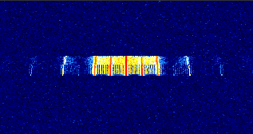

# RS41-NFW Operation manual

# NOTE! This manual became **outdated** as the further development kept going.
# **The most up-to-date documentation of all firmware features are comments in the code**.
## They became very very detailed now, please read them as you won't be disappointed. <br> If you still encounter questions, don't hesitate to ask.


* [Firmware configuration](#firmware-configuration)
  * [Recommended settings](#recommended-settings)
  * [Sonde PCB version](#sonde-pcb-version)
  * [IO assignment, dependencies](#io-assignment-dependencies)
  * [Radio signals config](#radio-signals-config)
  * [Other operation config](#other-operation-config)
* [Device operation](#device-operation)
  * [Starting the radiosonde](#starting-the-radiosonde)
  * [Device debug status and LED lights](#device-debug-status-and-led-lights)
  * [Button operation](#button-operation)
  * [Radio signals operation](#radio-signals-operation)
    * [PIP](#pip)
    * [Morse](#morse)
    * [RTTY](#rtty)
      * [Standard RTTY message format](#standard-rtty-message-format)
      * [Short RTTY message format](#short-rtty-message-format)
    * [Horus Binary](#horus-binary)
      * [Default Horus message format](#default-horus-message-format)
  * [XDATA port operation](#xdata-port-operation)
  * [Power management](#power-management)
    * [powerSave features](#powersave-features)
  * [Sensor boom](#sensor-boom)
    * [Temperature compensation](#temperature-compensation-and-calibration)
    * [Humidity calibration](#humidity-calibration)
    * [Reference heating](#reference-heating)
    * [Automatic sensor defrosting](#automatic-sensor-defrosting)
  * [GPS operation modes](#gps-operation-modes)
  * [Low Altitude Fast TX mode](#low-altitude-fast-tx-mode)
  * [dataRecorder feature](#datarecorder-feature)
  * [Fox hunting mode](#fox-hunting-mode)


## Firmware configuration
To configure the firmware, open the .ino project file in the IDE. <br>
Configuration options are located in definitions on the first ~200 of lines.
**READ ME:** the options in the firmware should be self explanatory (alongside with the comments near them). This manual should be up-to-date, but there may be some issues with it (it's hard to manage that long markdown file, sorry :) ). If you have **any** problems, questions and suggestions, feel free to open issues here!


### Recommended settings
The firmware by default is set with initial settings. For the first-time operation user should change the following: 
* Sonde version
* Callsign
* `radioPwrSetting`
* Battery power settings
* TX mode and frequency settings - recommended is Horus v2 mode at the 70cm amateur band - this provides the best range and speed capabilities. APRS is also ok.
* Sensor boom settings, together with temperature, humidity and calibrations
All settings are explained below.


### Sonde PCB version
The crucial part of the initial configuration is to set the appropriate sonde hardware version. Not setting the correct version will either cause compilation errors or result in a non fully-working device.
```cpp
#define RSM4x4 //new pcb versions
//#define RSM4x2 //old pcb versions, also rsm4x1
```
Uncomment the right definition to set it.


### IO assignment, dependencies
For the standard firmware operation, you shouldn't need to change them. <br>
Project dependencies are defined on the first lines in the `//===== Libraries and lib-dependant definitions` section. <br>
The system IO assignment is available in the `//===== Pin definitions` section - from there you can define the pin assignemnts and names to refer in the later code. <br>
In the `//===== Interfaces` part, the communication interfaces are set-up, like SPI class for radio IC and USART interfaces.


### Radio signals config
This is the first interesting part that a user should customize. It is located at the section `//===== Radio signals config`.  [More about radio here](#radio-signals-operation)<br>

**NOTE:** This part is out of date, if help needed, please follow the code comments. <br> <br>


```cpp
int defaultRadioPwrSetting = 0; //default TX power, also see lines down below; 0 = -1dBm (~0.8mW), 1 = 2dBm (~1.6mW), 2 = 5dBm (~3 mW), 3 = 8dBm (~6 mW), 4 = 11dBm (~12 mW), 5 = 14dBm (25 mW), 6 = 17dBm (50 mW), 7 = 20dBm (100 mW)
int powerSaveRadioPwrSetting = -1; //radio TX power for power save feature - deterimnes the TX power level at which the sonde will be transmitting when certain altitude (powerSaveAltitude), set to -1 to disable the powerSave features applying to the TX power. If this option is activated, the button logic for changing the radio power won't work
```
These are the settings for configuring the radio transmission power (0-7). The default value is `defaultRadioPwrSetting`. There is also a `powerSaveRadioPwrSetting` value, which is used when the [powerSave](#powersave-features) features are enabled, to disable, set it to -1.


```cpp
bool pipEnable = false; //pip tx mode
float pipFrequencyMhz = 434.5; //pip tx frequency
int pipLengthMs = 1000; //pip signal length in ms
int pipRepeat = 3; //pip signal repeat count in 1 transmit group
```
`pipEnable` - this enables the PIP mode. It's frequency can be set using `pipFrequencyMhz`, the `pipLength` in ms determines the pip carrier length and `pipRepeat` says how many times to repeat the signal in one TX cycle. <br>


```cpp
bool horusEnable = true; //horus v2 tx mode
float horusFrequencyMhz = 437.6;
unsigned int horusPayloadId = 256;
int horusBdr = 100;
```
This is the best transmission mode to use. Enabled via `horusEnable`, frequency set with `horusFrequencyMhz`, the baud rate is set with `horusBdr`, with 100 bdr recommmended. The payload-ID setting can be changed with `horusPayloadId`, which is described [in the guide below](#horus-binary-v2).<br>


```cpp
bool horusEnableSecondTransmission = false; //enable second horus transmission, may be used for example to transmit on different frequencies or at different intervals
float horusSecondTransmissionFrequencyMhz = 434.714;
unsigned int horusSecondTransmissionRepeatCount = 1;
unsigned long horusSecondTransmissionInterval = 0; //set to 0 for default delay (defined in defaultModeChangeDelay), otherwise will deterimne delay between first and second Horus transmission
```
`horusEnableSecondTransmission` enables second transmission mode of Horus, on a different frequency at `horusSecondTransmissionFrequencyMhz` (can be used to transmit on different frequencies used in other regions). The transmission can also be repeated a few times by `horusSecondTransmissionRepeatCount` (can be used to transmit faster telemetry on a different frequency not monitored by for example SondeHub servers, to not bloat the infrastructure/radio band). The interval for this transmission can be set with `horusSecondTransmissionInterval`.<br>


```cpp
bool aprsEnable = true;
float aprsFrequencyMhz = 432.5;
int aprsTxRepeatCount = 1;
char aprsCall[] = "N0CALL";  // Callsign
String aprsComment = " @RS41-NFW";
char aprsSsid = 11;                  // SSID for the call sign
char aprsDest[] = "APZNFW";       // Destination address for APRS
char aprsDigi[] = "WIDE2";     // Digipeater callsign
char aprsDigiSsid = 1;                // Digipeater SSID
char aprsSymbolOverlay = 'O';     // Symbol overlay
char aprsSymTable = 'a';       // Symbol table (e.g., 'a' for standard symbol)
int aprsOperationMode = 1; //1 - standard telemetry format (similiar to RS41HUP), 2 - WX format (weather station)
```
APRS transmission can be enabled via `aprsEnable`, on `aprsFrequencyMhz` frequency (note - APRS could sometimes transmit on a bit lower frequency, about 0.002MHz lower, so please check it twice), packets can be repeated in a transmit window with the `aprsTxRepeatCount`. Callsign is specified with `aprsCall`, comment (up to 50 symbols long) in `aprsComment`, callsign SSID with `aprsSsid`. Well, I think that most of them are self-explanatory :). The `aprsSymbolOverlay` sets the symbol (for example on the map) and tells the receiver what the payload is ('O' means a ham balloon and should be used for HAB flights).
The APRS operation mode can be selected here. 1 being normal telemetry reporting, which could be used for balloon payload tracking, and the 2 being WX weather station format, which sends traditional weather reports based on the onboard sensors.
Described later.


```cpp
bool radioEnablePA = false;  //default tx state
bool radioSleep = true; //lowers power consumption and recalibrates oscillator (drift compensation)
int defaultModeChangeDelay = 0; //in milliseconds, 0 - disable, 0<delay<2000 - standard delay, 2000<delay - delay + radio sleep mode and recalibration (if radioSleep enabled); default delay between radio transmission modes
int powerSaveModeChangeDelay = 5000; //as above, but activates when the powerSave is ON, set to -1 to disable changing of the transmission delay above powerSaveAltitude
```
These are the radio power management settings.<br>
`radioEnablePA` enables RF stage power amplifier to start sending signals. If you want the sonde to start transmitting signals immediatly after power ON, set this to true. If set to false, the PA can be enabled with a button, described later.<br>
`radioSleep` allows radio to go to sleep mode, which lowers the power consumption in-between transmissions, by turning OFF unnecesary IC components. Should be true unless you encounter any problems. <br>
`defaultModeChangeDelay` sets the delay in ms between transmissions. If set to 0 it means that the sleep is disabled and the transmissions occur as fast as possible, if enabled and the delay is under 2000msmit just waits in-between the modes, and if the delay is over 2s it also puts the radio to sleep in-between transmissions to lower the power consumption. The additional `powerSaveModeChangeDelay` variable is used when the [powerSave features are enabled](#powersave-features), to disable it, set to -1. <br>


```cpp
#define CALLSIGN "N0CALL"  //used for morse and rtty
bool rttyEnable = false; //rtty tx mode, compliant with UKHAS format
float rttyFrequencyMhz = 434.78; //rtty tx frequency
int rttyBitDelay = 22000;  //22000 ~= 45bdrate, 13333 ~= 75bdr
#define RTTY_RADIO_MARK_OFFSET 0x02 //for space offset set to 0x01, the rtty tone spacing will be: 0x02 - 270Hz spacing, 0x03 - 540Hz spacing | SPACING OTHER THAN 270HZ DOES NOT WORK (at lesast on my tests, will check later)
#define RTTY_RADIO_SPACE_OFFSET 0x01 //usually set to 0x01
bool morseEnable = false; //morse tx mode
float morseFrequencyMhz = 434.65; //morse tx frequency
int morseUnitTime = 40;  //ms
```

`CALLSIGN` should be changed to the user-specific one. It is used in both RTTY and Morse modes.<br>
RTTY can be enabled with `rttyEnable`, it's frequency is set with `rttyFrequencyMhz`.<br>
Transmission baud rate is determined by the `rttyBitDelay` value and indicates the delay in microseconds used after each bit begins. For baud rate 45 set the delay to 22000 and for the 75 baud - 13333.<br>
The message format is determined by the `rttyShortenMsg`. This setting is explained further down in the [radio operation](#radio-signals-operation).<br>
`RTTY_RADIO_MARK_OFFSET` and `RTTY_RADIO_SPACE_OFFSET` can determine offset values written to frequency offset registers of the radio chip. If you don't want to customize the RTTY shift, leave this at default. In some tests, there was an issue where offsets larger than 1 (0x02 - 0x01 = 1[base10] -> 270Hz) made errors in RTTY transmissions. <br>
Morse transmission can be enabled with `morseEnable`, transmitted on `morseFrequencyMhz` and with `morseUnitTime` as a symbol time in milliseconds. Both modes utilize the UKHAS telemetry format. Described later.


### Other operation config
This is the part that sets other operation variables that weren't mentioned earlier. It is located under the `//===== Other operation config` section in the project file.<br>

```cpp
bool ledStatusEnable = true;
int ledAutoDisableHeight = 1000; //height in meters above which the status LEDs get disabled
```
`ledStatusEnable` enables the LED to show device status messages. The LEDs can be automatically turned OFF when the payload starts flying, by setting the altitude threshold with `ledAutoDisableHeight`.<br>


```cpp
const int xdataPortMode = 0; //0 - disabled, 1 - debug uart, 2 - i2c (NO implementation now), 3 - xdata sensors (oif411)
```
This setting changes the XDATA port operation mode. This expansion port is described [here](#xdata-port-operation), with all of it's functions that can be set. <br>


```cpp
float vBatWarnValue = 2.5; //battery warning voltage
float vBatErrValue = 2.3; //error voltage
float batteryCutOffVoltage = 0; //good for nimh cell life, below 0.8V per AA cell the damage could occur
```
This sets different battery voltage settings.<br>
`vBatWarnValue` sets the voltage warning threshold, `vBatErrValue` sets the voltage error threshold and `batteryCutOffVoltage` determines at which voltage the radiosonde should automatically power OFF to protect the batteries (read your battery safety instructions and set this value according to it's safety measures!). By default, it is set to 0V to ensure that the full capacity of the battery is used. <br>


```cpp
int ovhtWarnValue = 45; //overheating warning
int ovhtErrValue = 55; //overheating error
```
These settings set the warning and error thresholds for overheating messages. This protects the batteries when the device is exposed to heat, for example by laying on the sun for too long. **Note:** this safety feature gets disabled if the built-in heater is enabled and the heater uses it's own safety rules. <br>


```cpp
int gpsSatsWarnValue = 4; 
```
`gpsSatsWarnValue` determines the warning threshold for GPS satellite visibility. <br>


```cpp
bool ubloxGpsAirborneMode = true; //sets the uBlox GPS module to the Airborne 1G Dynamic Model, which should prevent from loosing fix above 18km altitude
```
`ubloxGpsAirborneMode` - if true, on startup sends raw bytes to the GPS chips. This sets the Dynamic Model setting to the Airborne 1G mode, which should prevent the GPS from losing fix above around 18km of height. <br>


```cpp
int gpsNmeaMsgWaitTime = 1200; //waiting time for gps message
```
The `gpsNmeaMsgWaitTime` in ms sets the time that the device will wait for the GPS UART message to come. For a standard 1Hz GPS, it should be set somewhere between 1100ms and 1500ms, depending on the GPS internal refresh rate settings.<br>


```cpp
int oif411MsgWaitTime = 1200; //waiting time for oif411 message
```
The `oif411MsgWaitTime` in ms sets the time that the device will wait for the XDATA OIF411 message to come. It usually sends data in 1s intervals, so something around the 1200ms does the trick.<br>


```cpp
int powerSaveAltitude = 3000; //altitude in meters above which the powerSave features start to occur (currently, TX power is lowered from defaultRadioPwrSetting to powerSaveRadioPwrSetting and the transmision interval is changed from modeChangeDelay to powerSaveModeChangeDelay), set to -1 to completely disable all powerSave features
```
`powerSaveAltitude` defines the altitude above which the sonde activates the powerSave mode. [Operation descibed here](#powersave-features).<br>


```cpp
bool sensorBoomEnable = true; //enables sensor boom measurement (currently only temperatures, humidity is being engineered) and diagnostics
float mainTemperatureCorrectionC = 0;
float extHeaterTemperatureCorrectionC = 25;
bool autoHumidityModuleTemperatureCorrection = true; //should be left at true. The firmware corrects the humidity module temperature readings (which have worse accuracy than the main hook) by comparing the readings with the main temperature hook sensor. Both sensors should be in the same temperature.
```
The sensor boom measruements in the radiosonde can be enabled with `sensorBoomEnable`. Currently, the temperature offsets can be set for both main temperature (characteristic hook; `mainTemperatureCorrectionC`) and the humidity heater temperature sensor (`extHeaterTemperatureCorrectionC`). The humidity heater sensor can automatically calibrate by reading values from the hook sensor, but the hook sensor should be corrected by user.<br>


```cpp
bool autoTemperatureCalibration = false; //This option enables automatic calibration of the air temperature reading based on the method selected below. The process is marked as completed by 3 green LED blinks. If you disable it, you should do the offset calibration your self by the previous 2 values.
int autoTemperatureCalibrationMethod = 1; //1 - calibration based on the known constant air temperature (for example your room has 24*C and you turn ON the sonde in it, the sonde will correct automatically itself), you MUST then turn ON the sonde in this environment. 2 - based on the average PCB temperature. The PCB temperature should be adapted to the environment temperature. The function corrects the calibration slightly by the self-heating polynomial.
float environmentStartupAirTemperature = 24;
```
These options are explained in comments well, and the process is detailed [below](#temperature-compensation-and-calibration).


```cpp
bool humidityCalibrationDebug = false; //after calibration the sonde enters special mode that prints out on serial port the frequencies and a suggested humidityRangeDelta value. After it enters this mode, place the sensor in a 100%RH environment (for example close over a boiling water) and read the rangeDelta. This will give you a higher  accuracy of the readings.
bool humidityModuleEnable = true; //Setting that enables the support of humidity module
bool zeroHumidityCalibration = true; //if you don't know how to calibrate the values, leave true. The sonde will heat up the humidity module up to about 100*C and make some measurements
unsigned long humidityCalibrationTimeout = 300000; //calibration timeouts if it can't finish in (by default) 5 minutes (300000 milliseconds)
int humidityCalibrationMeasurementTemperature = 95; //minimum sensor temperature, at which the calibration function takes measurements
int humidityCalibrationHeatingTemperature = 115; //maximum temperature of heating element during calibration (should be higher than 100 + some margin)
bool referenceHeating = true; //This option enables slight warming up the reference heating resistors. This function works with the same method as the Vaisala firmware - maintaing temperature > 20*C of the cut out. When enabled, this should give just a slight improvement in temperature readings accuracy, increasing the power consumption a bit (suggested with 2xAA batteries
bool humidityModuleHeating = false; //This option enables the defrosting of humidity module and 'prevents condensation'. This function works the same as in Vaisala firmware, keeping the module slightly warmer than air, 5K above air temperature.
```
The humidity measurement using an onboard sensor can be enabled here. Whole process of usage and calibration is described in [sensor boom tab](#sensor-boom). The comments of the variables describe each.<br>


```cpp
unsigned long gpsTimeoutWatchdog = 1800000; //in milliseconds, the time after which the GPS chip resets if the position is not valid (no fix), kind of a watchdog, helps to retain the fix quicker, default 30 minutes (1800000 ms), set to 0 to disable
bool improvedGpsPerformance = true; //if true, the device improves the gps fix achieving performance. The issue is that the radio chip (Si4032) makes noise (so-called spurious emmissions), which affects the GPS L-band too, causing the receiver to have an overall lower sensitivity. This option changes the TX interval to 120s if the GPS didn't catch a fix; after GPS sees >3 satelites, the TX interval goes back to default set.
bool disableGpsImprovementInFlight = true; //this settings disables the improvedGpsPerformance features when the sonde is in-flight, because it can cause a loss of data for up to 2 minutes. If you fly under interference conditions, set this to false. Else - true;
```
Also seems self-explanatory, should be leaved as-is. Note, that if the sonde doesn't have a fix on ground, it transmits every 2 minutes.<br>


```cpp
float gpsLat = 0; //change this to set the default coordinates (updated with GPS position if enabled)
float gpsLong = 0; //change this to set the default coordinates (updated with GPS position if enabled)
```
If sonde is used as a stationary device, like a weather station, these variables can be changed to set the coordinates.<br>


```cpp
int gpsOperationMode = 1; //0 - fully OFF (stationary use, like WX station, the stationary coordinates can be specified in gpsLat-gpsLong); 1 - default, always ON; 2 - powersaving when fix OK (only on old sondes, lowers power consumption by +-30mA. Not implemented on newer sondes, because their GPS already draws very little current, comparable with the old one in power-saving, also they don't have an obvious power saving mode, only some interval-like ones).
unsigned long gpsPowerSaveDebounce = 300000; //debounce to limit setting the GPS back and forth into the power saving mode
```
The GPS has a few operation modes, selected by `gpsOperationMode`. If set to 0, the GPS is fully turned OFF, which could be utilized in stationary devices like weather stations, which do not need tracking and the power consumption matters. 1 - means an always on setting, which should be selected by default. 2 - means a power saving mode, only utilized on the old sondes (new revisions don't need it), which lowers the power consumption by 30mA. Note, that when the sonde doesn't have a stable satellite reading, it will automatically go back to default, max performance mode. The switching between modes can be delayed with `gpsPowerSaveDebounce`. <br>


```cpp
int lowAltitudeFastTxThreshold = 1000; //set to 0 to disable. When sonde is descending after a burst, when it goes below this threshold, it goes into a 'lowAltitudeFastTx' mode, in which it only transmits horus packets as fast as it can, to possibly catch the lowest frame, works only with horus (APRS would overload the infrastructure)
unsigned long lowAltitudeFastTxDuration = 120000; //duration of how long this mode will work, in milliseconds
int lowAltitudeFastTxInterval = 1; //delay between transmissions in this mode, should be left at 1 to catch the lowest frame possible
unsigned int flightDetectionAltitude = 1000; //default flight detection altitude in meters (if exceeded, the sonde knows that the flight began)
unsigned int burstDetectionThreshold = 2000; //describes threshold value, which if exceeded (below maxAlt) deterimnes if the balloon has burst (2000m seems reasonable, due to some being floaters or getting 'unsealed')
```
Explained later, but comments should explain everything.<br>


```cpp
int buttonMode = 1;                                 //0 - button operation disabled, 1 - the button can turn the sonde OFF, 2 - extended mode, allowing to control radio power and if the transmission should be enabled and shutdown. If you want to fly a sonde with PV or on 1xAA hardware, consider disabling the button and shorting its pins for always closed state. NOTE: the button will only operate when the sonde has fully started (after calibration, compensation, hardware configuration etc.)
```
Button operation mode can be selected here. 0 - disabled, 1 - pressing the button (actually holding a second or so) will power the sonde OFF, 2 - extended mode, which, besides turning the sonde OFF, allows to turn radio transmission ON/OFF and select radio power. <br>


```cpp
//dataRecoder config
bool dataRecorderEnable = true; //enables mode, in which the sonde transmits some recorded and debug data to the ground via additional APRS comments (described in repo). Format: ...NFW;[maxAlt];[maxSpeed];[maxAscentRate];[maxDescentRate];[maxMainTemperature];[minMainTemperature];[maxInternalTemp];[minInternalTemp];[ledsEnable];[healthStatus];[gpsResetCounter];[beganFlying];[burstDetected];[isHeaterOn];[radioPwrSetting];[currentGPSPowerMode];[radioTemp];...
unsigned int dataRecorderInterval = 600000; //10 minutes by default (600000 milliseconds)
```
Data recorder features can be configured here, operation also described later. <br>


```cpp
bool autoResetEnable = true; //automatically reset the CPU after specified time below, useful in stationary continuous use, to prevent from overflowing some variables
#define SYSTEM_RESET_PERIOD (14UL * 24 * 60 * 60 * 1000) // 14 days in milliseconds
```
The sonde can reset the CPU automatically to prevent from overflow. By default the interval is 2 weeks. <br>

```cpp
unsigned int flightDetectionAltitude = 1000; //default flight detection altitude in meters (if exceeded, the sonde knows that the flight began)
unsigned int burstDetectionThreshold = 2000; //describes threshold value, which if exceeded (below maxAlt) deterimnes if the balloon has burst (2000m seems reasonable, due to some being floaters or getting 'unsealed')
```
These options configure how flightComputing function works (default should work properly, unless, for example, the sonde is being launched high in the mountains.) <br>

```cpp
bool ultraPowerSaveAfterLanding = false; //20 minutes after landing the sonde will turn OFF the GPS completely, turn OFF all sensors and change the transmit interval to 10 minutes and switch to Horus and APRS, transmitting the last coordinates
```
Extra power saving features can be enabled after landing with this function, described in the power management part of this manual. <br>


```cpp
//Fox hunting mode
bool foxHuntMode = false; //enables the fox hunting mode. This mode is separate from standard HAB operation mode. It can only transmit morse and FM melody sounds on a specified frequency. The firmware minimises the current consumption. In this mode, only the simplified button operation mode is used (1 only power OFF) and the status lights are simplified - green LED blinking when OK, orange LED when something is wrong (for example low battery).
bool foxHuntFmMelody = true; //in fox hunting mode, enables a melody transmitted with the onboard radio
bool foxHuntCwTone = false; //if you prefer a CW tone instead of a FM melody, the tone length is 10s
bool foxHuntMorseMarker = true; //in fox hunting mode, enables a morse marker transmitted after the melody with the text specified below. Warning - the marker is transmitted in CW, not in FM! Use a side-band capable receiver to receive it.
String foxMorseMsg = "N0CALL N0CALL FOX";
bool foxHuntLowVoltageAdditionalMarker = true; //when the low voltage threshold is met (specified with vBatWarnValue), the additional marker is activated, to send for example transmitter location
String foxMorseMsgVbat = "N0CALL N0CALL FOX 11.123456 12.456789";
float foxHuntFrequency = 434.5;
unsigned int foxHuntTransmissionDelay = 0; //delay in fox hunting mode between transmission cycles in ms
```
The firmware also contains fox hunting mode. More about it later. <br>


```cpp
bool enablePressureEstimation = false; //This option enables an algorithm that estimates the pressure of dry air, based on altitude, temperature and humidity. It is NOT read from any pressure sensor, like an RPM411 board (now!), but can give you a fair enough reading, more of an 'order of magnitude'. The pressureValue is sent via Horus v2 and APRS WX
unsigned long seaLevelPressure = 101325; //Sea level pressure in Pascals, used to correctly estimate the pressure in the upper layers
```
This is the config of pressure estimation (like in RS41-SG sondes?). Described in comment and [here](#pressure-reading). <br>


```cpp
#define THERMISTOR_R25 10400  // 10k Ohms at 25°C thermistor 
#define THERMISTOR_B 4295     // Beta parameter calculated thermistor
```
These settings change the onboard thermistor characteristics, values were calculated for the default hardware and shouldn't be changed, unless the thermistor reading differs significantly from the real temperature. <br>

**Note:** The later definitions are system-only and shouldn't be changed by user.


## Device operation

### Starting the radiosonde
The radiosonde can be turned ON either by:

* Shortly pressing the button - refer to [Button operation](#button-operation) and [LED status](#device-debug-status-and-led-lights)
* Sending 13.56MHz carrier to the NFC coil - you can simply bring the back of your NFC-enabled smartphone closely to the bottom part of the sonde, near the button and LEDs

### Device debug status and LED lights
Immediately after pressing the button, during the setup function, the LEDs can blink a few times indicating different things done.

<br>

Device debug states, LED colors and conditions, during normal device operation:
* OK - continuous green light
  * If no valid warning or error, ok is true
* Flight-ready, but wait a while - blinking green LED
  * Sonde has fix and is still waiting to discover more GPS signals to lock on before launch. The radio may still be not transmitting, wait for the continuous green light.
* Warning - continuous orange light (both red and green make orange-like color)
  * `vBatErrValue` < Battery voltage < `vBatWarnValue`
  * GNSS satellites < `gpsSatsWarnValue`
  * `ovhtErrValue` < Thermistor temp. < `ovhtWarnValue`
* Error - continuous red light
  * Battery voltage < `vBatErrValue` < `vBatWarnValue`
  * `sensorBoomMainTempError` OR|| `sensorBoomHumidityModuleError`
  * Thermistor temp. < `ovhtErrValue` < `ovhtWarnValue`
* Constant red LED and blinking green LED (red-orange pattern)
  * Only if `improvedGpsPerformance` is enabled.
  * The sonde has no fix and is waiting to gather it. The radio is not transmitting and waiting to transmit after GPS fix is acquired.
  
* Undefined status - continuous orange light
  * If 2 error levels happen simoultaneously (for example warn and error), this sets the status to undefined, which never happens, but is possible.

<br>

LED status lights can be permamently turned OFF by defining `ledStatusEnable = false`. LED status lights turn OFF itself above 1000m to save the power.

The LEDs also change their status when the button modes are being selected, which is described in [Button operation](#button-operation).

The `heaterDebugState` calculation is described in the [Heater algorithm](#heater-algorithm).


### Button operation
The button operation mode can be selected with `buttonMode`.<br>

If set to 0, the button gets completely disabled, the only way to turn the sonde OFF is by cutting the power (for example remove the batteries). <br>

If set to 1, the button can turn the sonde OFF on it's press (press - due to tasks management, the actual press length may vary between 0 and 5 seconds).<br>

When the mode is set to 2 (not suggested at all, please stick to the mode 0 or 1), button operation algorithm contains a page-like setting system, with pages from 1 to 4, whereas each page can be recognized by a 500ms GREEN-RED LED cycle. Entering a page is done by holding the button until the desired page number is selected, and then by releasing the button at this desired page number (previous RTTY configuration pages were deleted - who uses the RTTY today in HAB flights ? :) ):
* Page 1 - `empty` - unless there is a function ongoing (currently this can cancel the improveGpsPerformance setting when active).
* Page 2 - `radioEnablePA`. Green blinks 2 times for true, red 2 times for false.
* Page 3 - `radioPwrSetting`. Green blinks 3 times for 100mW (7 max), red 3 times for 2mW (0 min). *annotation below*
* Page 4 - `SHUTDOWN`. If button is held to this page the red LED comes ON for 3 seconds and then the sonde is turned OFF.

For example, changing the page 3, with default configured value of 100mW, changing the radio power to 2mW would look like this in a sequence:

```
        *btn-hold* -----> *btn-released*
        | page1 | page2 | page3 |   |2mW confirm|   |continuing operation...
RED_____----++++----++++----++++____------------    _______________________
GREEN___++++----++++----++++----____++--++--++--    _______________________
```
<br>


### Radio signals operation

The radio modes are switched in cycles. Each cycle contains a transmission with each mode. Each transmission in one of the modes can be separated from the other with a defined `..Wait` variable (for example horusWait), described above.

#### PIP
<p align="center">
<br>
</p><br>

This is an unmodulated carrier signal with no information carried. It can be used as beacon to show the presence of the transmitter, for example used in fox hunting.


#### Morse
<p align="center">
<br>
</p><br>

This is a single carrier signal that sends data using the same format as RTTY (descrpition below).


#### RTTY
<p align="center">
<br>
</p><br>

This is a 2-FSK signal. The data format is compliant with UKHAS format, additionally sending a GPS satellites count, battery voltage and temperature.


#### Horus Binary v2
<p align="center">
<br>
</p><br>

This is a 4-FSK signal made by [projecthorus](https://github.com/projecthorus) for use in HAB and other simple telemetry protocols. Please, in your free time, read the [wiki](https://github.com/projecthorus/horusdemodlib/wiki) about it to make sure you know everything. <br>
In short, this is a **very** efficient and weak-signal protocol. With much better performance (8dB over RTTY), forward error correction and checksums it is ideal for this use case. <br>

For the testing purposes, you can use the default 4FSKTEST-V2 payload ID (id 256) provided by the Horus creators with this project's adapted payload message format. However, for real HAB flights, it is recommended to write to them for assigning a new payload ID and an optional custom message format directly for your application. More about it in their wiki.<br>

The easiest way to decode this format is to use an SDR together with Horus-GUI for Windows, which only needs setting up the audio interface (you can use a default Stereo Mix loopback) or even better, UDP audio stream from SDR software, such as SDR++. Detailed instructions on how to setup the demod are also on their wiki.


##### Default Horus message format
This project uses Horus v2 binary format, with 32 byte message length. This table shows how the dummy payload data places are populated according to the 4FSKTEST-V2 decoding description (it's not byte-to-byte compatible with the format used by default in the RS41ng firmware):

| Data             	| Description                                                                                      	|
|------------------	|--------------------------------------------------------------------------------------------------	|
| PayloadID        	| Default 4FSKTEST-V2 for testing purposes = 256                                                   	|
| Counter          	| Packet counter                                                                                   	|
| Hours            	| Time hours (from GNSS)                                                                           	|
| Minutes          	| Time minutes (from GNSS)                                                                         	|
| Seconds          	| Time seconds (from GNSS)                                                                         	|
| Latitude         	| gpsLat                                                                                           	|
| Longitude        	| gpsLong                                                                                          	|
| Altitude         	| gpsAlt                                                                                           	|
| Speed            	| gpsSpeedKph                                                                                      	|
| vBat             	| Battery voltage, interpreted there as an uint8 value from 0-255 (real 0-5V), mapped in the code. 	|
| Sats             	| gpsSats                                                                                          	|
| Temp             	| Thermistor temperature integer                                                 	                  |
| vertical V.       | vVCalc - vertical velocity calculated                          	                                  |
| extTemperature   	| External temperature integer (from sensor boom)                                         	        |
| humidity        	| humidity                                         	                                                |
| pressure        	| Pressure (estimated - no sensor support now)   	                                                  |
| empty             | empty                  	                                                                          |

<br>
When the OIF411 is connected, the last 5 dummy places change to this unofficial format (good for testing only):

| Data               | Description                                                                                 |
|-------------------|--------------------------------------------------------------------------------------------- |
| dummy1            | When OIF411 connected, sends the ozone electrode current                                     |
| dummy2            | When OIF411 connected, sends the ozone battery voltage                                       |
| deviceDebugState  | Device debug state uint8 integer                                                             |
| dummy4            | When OIF411 connected, sends the ozone pump temperature                                      |
| dummy5            | Not decoded in this encoding scheme (4FSKTEST-V2 doesn't provide decode desc. for dummy5)    |


#### APRS
<p align="center">
<br>
</p><br>

This implementation is a standard APRS 1200bd modem with tones at 1200Hz and 2200Hz. It supports 2 message formats - standard for HAB tracking and WX format for weather station reports, which currently send temperature and humidity external in their reports, and internal temperature and battery voltage in APRS comment.


### XDATA port operation
The RS41 sondes provide an expansion port on the bottom part of the device, which implement a protocol called XDATA. The capabilities of the device allow users to utilise them like standard GPIO pins. The following modes of it's operation are available via setting the `xdataPortMode`:
* Disabled (0) - fully disables the XDATA IO pins
* Debug UART (1) - utilizes the XDATA pins (number 2 and 3) to print out the debug messages as a standard serial port (@115200 baudrate, can be changed).
* I2C (2) - not supported now and probably won't be, external sensors via I2C are far worse option than having an accurate sensor boom.
* XDATA UART (3) - utilizes the XDATA pins as their default use was - to connect XDATA capable devices. Currently the only device supported and decoded is the OIF411 ozone sounding pump with ECC electrodes. (XDATA protocol uses a simple 9600baud UART with properitary message format)

<br>

The UART and I2C capabilities cannot be used at the same time.<br>


### Power management
Device measures the battery voltage and according to this sets the warning and error messages (described above).<br>
The sonde also has some power saving capabilities, like radio sleep and LED turn OFF at heights, or GPS management.

#### powerSave features
The sonde has GPS power saving features, described later in GPS opeartion modes.

Besides that, some power saving features are activated above certain altitude. This behaviour is determined by the `powerSaveAltitude` variable in meters.
The power saving changes 2 settings - radio TX power and interval between radio modes. <br>

*writeup here needed*

The sonde also has an ability to lower the consumption after landing. If enabled via `ultraPowerSaveAfterLanding`, 20 minutes after landing the sonde fully turns of the GPS, sensors and some peripherals, only leaving the CPU working, together with radio, which transmits Horus, APRS and dataRecorder values every 10 minutes, consuming around 55mA. In future we want to investigate the STM power saving capabilities.


### Sensor Boom
Each RS41 radiosonde has a sensor boom (the shiny elastic part with a characteristic hook). This firmware, being probably the first one, allows to utilize all advanced functions of it. The external temperature is being sent to ground in Horus v2, APRS, APRS WX, morse and RTTY payloads, and the humidity is sent by Horus v2 and APRS WX (by default; APRS can also send it down, just needs a little bit of code mod). The firmware also performs self-tests on the sensor which notify about either external temperature sensor fault, humidity module fault or entire sensor hook problem, both with LED status lights and on the debug UART terminal. <br>

#### Temperature compensation and calibration
Linearity of these sensors is very similiar in each. However, each one has a different temperature offset, which should be corrected by user. There are 3 methods of compensation. Two of them are automatic. <br>
You can select `autoTemperatureCalibration` and the first method is set by `autoTemperatureCalibrationMethod = 1`. This setting compares the readings to a known value of air temperature, specified in `environmentStartupAirTemperature`. Set this to a temperature, in which the sonde will be turned ON, for example temperature of launch site or your room. When the sonde gets powered ON, the auto calibration begins. This is the most accurate way, together with the way of manual compensation in option 3. The measurement error here is the same as the third method, anywhere between 0 and 1.5*C.

Second method is `autoTemperatureCalibrationMethod = 2`, which means comparing the air temperature redaing to the average PCB temperature. NOTE: the PCB has to match the temperature of the air, for example when the sonde was laying in the room for last 30 minutes, the power ON procedure has also to be done in this room. If it layed outside, then you have to power it ON outside. The calibration process also compensates slightly for self-heating effect and temperature memory effect using a carefully set polynomial. This way is accurate when the PCB has a stabilised temperature near the air temperature. The measurement error here could be anywhere from 0 to 3*C, assuming the PCB temperature is stabilised.

The last, third way to compensate for the offset is the manual offset setting. This option is the most time-consuming and provides similar results to the autoCalibrationMethod = 1. Upload the firmware with sensor hook enabled and, preferebly, with Horus or APRS telemetry. Place the sonde in a stable environemnt and wait for it to boot (you main need to disable `improvedGpsPerformance` and `zeroHumidityCalibration` for now, because they aren't needed now and slow down the startup). Now, when the sonde is transmistting, take another independant temperature sensor, place it near the sonde and wait for it's reading to stabilize. If you have your real temperature measured, observe the sonde readings. Write down the average readings of the temperature (they might fluctuate a 1.5C or so) and calculate: `(real measurement) - (sonde measurement) = mainTemperatureCorrectionC`. This will be your temperature compensation offset. The calibration is done and you can enter this value into the firmware config. Note - this value is only for this sensor boom, if you want to use another one, you have to correct it another time. If your correction factor is higher than 25, consider changing the sensor hook to another one, because this could indicate a faulty unit. <br>
If you have enabled the `autoHumidityModuleTemperatureCorrection` you won't have to do anything again for the second temperature sensor, which is located in the humidity module (white glass/ceramic plate). The sonde will simply correct it for you.

#### Humidity calibration
NFW reads the humidity in a simpler way than originally. This approach was chosen because of 2 reasons - more accurate readings would require from user to read Vaisala calibration values using a script from for example SondeHub (which gathers that telemetry data) and write into configuration of NFW **a lot** of values and data arrays (probably around 70 lines of raw factors), and also because I simply couldn't get it to work :). So instead, the sonde will make a zero humidity check (like originally before launch), calculate some values and using them and the compensation by air temperature will calculate the RH. <br>

To calibrate the humidity sensor, the firmware config needs to have enabled options `humidityModuleEnable` and `zeroHumidityCalibration`.<br>
Place the sonde in a place with very little to no airflow, your room will be probably best. The calibration can also be done outside, but may last a little longer. The environment should have as small wind as possible, with temperatures ideally ranging from 0 to 30C, and humidity from 0 to 60%. <br>

After powering ON the sonde, the orange LED light will light up. This means that the calibration has started and the sonde is preparing for calibration. The light should turn OFF and start to blink. **Warning** - the sensor boom, especially the hudmidity module (white glass/ceramic plate) will become very hot (around 120C), because it has built in 2 heaters used exactly for the calibration. Longer blink indicates that the heater is operating, shorter orange blink means that the measurements were taken. Whole calibration should last around a minute, and if there is some problem, it timeouts automatically or after 3 minutes max. Any issues during calibration are indicated with red LED (5 blinks for hardware error, 3 blinks for environment/first measurement problem). If the calibration succseeds, the sonde begins to operate as normal. The humidity module has to cool down now, so don't touch the sensor boom for the next minute. The readings will stabilise also after a minute. <br>

If you find that the readings are off (more than 15%, that is the accuracy here), or you simply want the best accuracy possible, you may need to either replace the sensor boom for another one, or perform an extended calibration, which can be activated by `humidityCalibrationDebug`. To use it correctly, run everything as described before, but with the sonde UART connected to your interface (by default it is 115200 baud, the `xdataPortMode` has to be 1). Now, after the calibration has ended, the sonde will run the extended calibration instructions. Now, prepare an environment with 100% relative humidity. The easiest method is to boil some water. After the sensor has cooled down, place the sensor boom near the surface of the boling water, to cover it in fog. Make sure that it is NOT touching the water surface and the water (if you do it while wamring up the water) doesn't splash on the sensor. Now, by looking at the serial terminal, observe what is the value of `humidityRangeDelta` with the sensor in the fog. Wait a while and write down the highest values captured during the test which will be your `humidityRangeDelta`. The sonde can be gracefully turned OFF by holding the button, and according to the serial port output, you can now flash the firmware with this mode disabled. During programming, change the value of `humidityRangeDelta` in your config. The default value set here (1000) is based on a bit of empirical tests and averaging the results of good sensors. If your delta value is lower than 750 or higher than 1600, consider performing the calibration once again, and if the result is the same, change the sensor boom. Now your humidity sensor should be calibrated and working.<br>

The sensor has about 5 seconds of reaction time, especially under lower temperatures. Also, the firmware compensates the humidity value according to the air temperature (adapted from algorithm used in radiosonde_auto_rx, based on empirical data from flights), to ensure that readings are as accurate as possible with this method.<br>

Other methods of reading humidity probably aren't worth a while, and this method seems quite simple and accurate for what can be achieved with this device. I wouldn't predict weather with it knowing that it could be off a bit, but for amateur usage it is more than enough.

#### Reference heating
The firmware uses reference resistors (like in factory) placed on the cut-out part of the PCB to calilbrate the temperature measurements. Their parameters change slightly under very low temperatures, so to compensate for that, Vaisala implemented mechanisms for heating them.<br>
If you want to achieve a very slightly better accuracy of the temperature readings (only use this with 2xAA batteries due to higher consumption), you can activate this by the setting `referenceHeating` (OFF by default). The function will maintain a stable temperature of the cut-out part of the PCB, at around 18*C. The heating algorithm uses different power levels for different temperatures to save some power during its operation.

#### Automatic sensor defrosting
Vaisala implemented heaters in the humidity module. Their use (apart from the ground-check) is to prevent from condensation and frost on the humidity sensor. The NFW firmware takes advantage of it by regularly heating up the sensor for (by default) 3.5 seconds at high power, to take off any frost/water/ice/anything that gets on it. It can be enabled with `humidityModuleDefrosting` (OFF by default!), and activates both above the `defrostingHumidityThreshold` and below `defrostingTemperatureThreshold`. These values should activate the defrosting only in high-humidity environments with low temperatures that could lead to water or ice on the sensor (for example clouds). Now, the sonde continuously maintains its temperature 5K (5*C) above air temperature. The algorithm ensures the temperature is stable and power consumption adjusts accordingly, using PWM. Currently, we observed that it may impact the readings, so it should only be enabled for humid flights (for example dense clouds in different layers).

#### Pressure reading
Currently, the pressure sensor board (RPM411) isn't supported, so can be detached. However, the NFW calculates dry air pressure from various factors, including temperature, altitude and relative humidity. This allows it to estimate the pressure, just like in RS41-SG models. It isn't the most accurate formula, but should be just enough for amateur use. The user should input the current `seaLevelPressure` for better accuracy. The whole pressure estimation algorithm can be enabled with `enablePressureEstimation`.

### GPS operation modes
In mode 0, the GPS is completely disabled, which could be used for example in a weather station. In both versions of sondes, this gives a power consumption of 50-60mA when idle (no radio TX)<br>
In mode 1, the GPS works with maximum performance, and consumes about 120mA on older sondes and 85mA on newer (no TX)<br>
In mode 2, the GPS is set to power saving mode (only on older ones, newer don't require this). If the sonde has a stable fix (> 6 satellites), the GPS is set to power saving, which lowers the consumption to about 85mA, similarly to the new ones. When the sonde loses on the GPS satellites under 6, the max performance mode is temporairly set. The debounce between the changing can also be set.<br>

The GPS logic also has an algorithm for improving it's performance and sensitivity. The Si4032 when transmitting generates some noise, which seem to affect the GPS performance. By default (every setting is described in the firmware file/on the begining of this manual), when the sonde doesnt have a fix, it transmits the telemetry every 2 minutes. When the fix is gathered, the default interval is set back. This algorithm can be used also in flight, but is only suggested for flights were it could really help (where there is lots of interference). Otherwise, please leave the setting to disable it in-flight to true, because it could lead to a data loss for up to 2 minutes if GPS makes a mistake. When the sonde waits for enough satellites, the green LED is blinking every second or so. This mode can be disabled, as always, in the firmware settings, or when the `buttonMode` is set to 2, with a button on page 1 (mentioned in the button operation manual).


### Low Altitude Fast TX mode
NFW has a feature, that sends the Horus packets as fast as it can for a specified period of time. This can be used to track the last meters of the flight. With the delay set to 0, the sonde can transmit Horus v2 every 6s, maintaining the GPS and sensor readings.

### dataRecorder feature
After one of the flights, which had a siginificant GPS interference, we wanted to somehow store some important statistics during the flight. If this feature is enabled, gathered data is sent once every 10 minutes via APRS as an additional data to the comment section.<br>
Received data can be then decoded into a human-readable format by either pasting it into a very simple Python script ([here](https://github.com/Nevvman18/rs41-nfw/tree/main/fw/nfw-dataRecorder-decoder/decoder.py)), or by looking at this structure:
`NFW;[maxAlt];[maxSpeed];[maxAscentRate];[maxDescentRate];[maxMainTemperature];[minMainTemperature];[maxInternalTemp];[minInternalTemp];[ledsEnable];[healthStatus];[gpsResetCounter];[beganFlying];[burstDetected];[radioPwrSetting];[currentGPSPowerMode];[radioTemp];[zeroHumidityFrequency];[humidityRangeDelta];[heatingPwmStatus];[referenceHeaterStatus];[mVBatU];[readThermistorTemp]`.

### Fox hunting mode
NFW contains a fox hunting mode. It minimises the power consumption and transmits using 4 different modes. <br>
`foxHuntFmMelody` transmits a short melody a couple of times in NFM modulation, which can be received by many radios. `foxHuntCwTone` is a continuous wave tone, like a pip, lasting 10s. `foxHuntMorseMarker` transmits a morse sentence also using CW, the text can be changed in `foxMorseMsg`. The last one is also a morse sentence (`foxMorseMsgVbat`), but occurs only when the battery is below the `vBatWarnValue`, where can for example specify additional coordinates of the transmitter. Power handler is working in this mode, meaning that the sonde can turn OFF when the battery voltage is below a specified threshold. The battery voltage is also sent on the end of the morse message.


## Final words

This guide describes probably most of the device working aspects. However, if you encoutner any issues or some information isn't there, please let us know at the repo Issues tab. Thanks.
