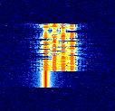
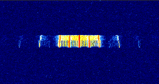
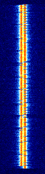
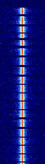
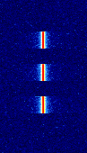

# RS41-NFW Operation manual

This manual describes how an RS41-NFW sonde behaves and how each feature works. It is current for **firmware v69**.

> **Where the settings live:** all user options are in a single file, [`CONFIG.h`](../rs41-nfw_sonde-firmware/CONFIG.h), grouped into clearly numbered sections with a short comment on every line. You do **not** edit the main `.ino`. The easiest way to set everything is the **[NFW Sounding Software](../README.md#rs41-nfw-sounding-software)** ([nfw.flada.ovh](https://nfw.flada.ovh)), which shows the same options as a guided form and compiles the firmware for you. The per-line comments in `CONFIG.h` are always the authoritative reference; this manual explains the *why* and the *how it behaves*.

* [Firmware configuration overview](#firmware-configuration-overview)
  * [Board revision](#board-revision)
  * [First-time settings to change](#first-time-settings-to-change)
* [Device operation](#device-operation)
  * [Starting the sonde](#starting-the-sonde)
  * [Operation stages](#operation-stages)
  * [Status LEDs](#status-leds)
  * [Button operation](#button-operation)
* [Transmission modes](#transmission-modes)
  * [TX timing - the GPS-clock scheduler](#tx-timing---the-gps-clock-scheduler)
  * [Horus Binary V3](#horus-binary-v3)
  * [Horus Binary V2 (legacy)](#horus-binary-v2-legacy)
  * [APRS](#aprs)
  * [RTTY](#rtty)
  * [Morse](#morse)
  * [Pip](#pip)
  * [Fox-hunt mode](#fox-hunt-mode)
* [Sensors and calibration](#sensors-and-calibration)
  * [Sensor boom](#sensor-boom)
  * [Sensor calibration mode (NFW vs Vaisala factory)](#sensor-calibration-mode-nfw-vs-vaisala-factory)
  * [Temperature calibration](#temperature-calibration)
  * [Humidity calibration](#humidity-calibration)
  * [Pressure](#pressure)
  * [Heating](#heating)
* [GPS](#gps)
* [XDATA port and OIF411 ozone](#xdata-port-and-oif411-ozone)
* [Flight computing and recovery](#flight-computing-and-recovery)
  * [Flight detection and burst](#flight-detection-and-burst)
  * [Low-altitude fast-TX](#low-altitude-fast-tx)
  * [Data Recorder](#data-recorder)
* [Power management](#power-management)


## Firmware configuration overview

`CONFIG.h` is organised into sections (board revision, TX timing, each radio mode, status LEDs, XDATA / OIF411, power, GPS, sensor boom, temperature and humidity calibration, pressure, heating, fast-TX, flight computing, system, button, data recorder, and the filter/PID constants). Each value carries a comment; read it before changing anything.

### Board revision

The one setting you must get right. In Section 1 of `CONFIG.h`, uncomment exactly one line:
```cpp
// #define RSM4x4   // RSM4x4 / RSM4x5  (STM32L412RBT6, LQFP64) - newer boards
// #define RSM4x2   // RSM4x2 / RSM4x1  (STM32F100C8T6B, LQFP48) - older boards
```
The PCB revision is printed at the bottom of the board. If you are unsure which one you have, see [hw/README.md](../hw/README.md#older-vs-newer---how-do-i-know-which-one-im-holding-now). In the Sounding Software you just click your board; the comparison table there lists every difference between the two. Selecting the wrong board will not compile correctly or will not run properly.

### First-time settings to change

For a first flight, review at least:
* Board revision (above).
* Callsign(s): `aprsCall`, `CALLSIGN` (RTTY/Morse), `HORUS_V3_CALLSIGN`.
* Which TX modes are enabled and on which frequencies (Sections 2-9).
* TX power per mode (`...RadioPower`, key in the Pip section).
* Sensor boom, temperature and humidity calibration (Sections 15-17).

All of these are explained below.


## Device operation

### Starting the sonde

Turn the sonde on by either:
* Briefly pressing the onboard button, or
* Holding an NFC-enabled phone (13.56 MHz) against the bottom of the sonde near the button.

On power-up the firmware runs its start-up sequence (hardware init, sensor boom and GPS init, then any enabled calibration) before entering the main loop. Watch the [operation stage](#operation-stages) and the [LEDs](#status-leds) to follow progress.

### Operation stages

The firmware reports a numeric **operation stage** (e.g. `01`...`59`) throughout start-up and flight. With the XDATA port in mode 1 these are printed on the serial log and shown live by the Ground Station tab of the Sounding Software, so you always know what the sonde is doing. Stage **59 - READY FOR FLIGHT** means start-up and all calibrations finished without error and the sonde is cleared for launch.

### Status LEDs

This is the same scheme the Sounding Software shows next to the ground-check steps.

LED meaning during **normal operation**:
* **Solid green** - all OK, a GPS fix is held and there are no warnings. Ready, or flying normally.
* **Solid orange** - running OK but no GPS fix yet.
* **Solid red** - an error is active (sensor-boom fault, RPM411 fault, calibration error or battery warning). Check the serial log / Ground Control.
* **Off** - LEDs disabled, or the sonde climbed above the auto-disable altitude.

LED meaning during **start-up and calibration**:
* **Solid red** - hardware initialisation right after power-on (stages 01-04).
* **Blinking orange** - a calibration is in progress (temperature / reconditioning / zero-humidity). During reconditioning and zero-humidity the module is hot (~140 C) - keep clear of the boom.
* **Red blinks** - an error during start-up or calibration (e.g. sensor-boom fault or calibration error). Check the log.
* **5 quick green blinks** - boot complete, system started and entering normal operation.

A brief hold of the button in power-off mode is confirmed by **3 red blinks** before the sonde shuts down.

LEDs can be disabled entirely (`ledStatusEnable = false`) and turn themselves off above `ledAutoDisableHeight` (default 1000 m) to save power.

### Button operation

`buttonMode` (Section 23):
* **0** - button disabled. The only way to power off is to remove power. (Useful with solar or 1xAA supplies; you can short the button pads to keep it permanently "pressed".)
* **1** - a brief hold powers the sonde off. Recommended for most use cases.
* **2** - cycling menu: release at the desired option.
  * 1 blink = cancel `improvedGpsPerformance`
  * 2 blinks = disable the radio PA
  * long hold = power off

The button only acts after start-up has fully completed. Hold time may vary roughly 1.5-3 s depending on CPU load.


## Transmission modes

### TX timing - the GPS-clock scheduler

At **5 s and above**, every mode is scheduled against the GPS clock (Section 2). For each mode you set:
* `[mode]TimeSyncSeconds` - transmit every N seconds, aligned to the top of the hour. Example: `15` transmits at :00, :15, :30, :45 of each minute.
* `[mode]TimeSyncOffsetSeconds` - an extra delay after each slot. Example: period 15, offset 2 transmits at :02, :17, :32, :47. Handy for separating several sondes in the air.

**Simple fast-TX (interval 0-4).** Setting a *data* mode (Horus V3/V2, APRS, RTTY, Morse) below 5 s switches the whole sonde out of GPS-clock scheduling and into a plain loop: each cycle it refreshes the GPS and the sensor boom, transmits every enabled mode back-to-back, then waits the configured number of seconds (`0` = no wait, as fast as possible). Offsets and slot alignment do not apply - below 5 s the scheduler is oriented for **data density rather than clock synchronisation**. Keep the interval at **5 s or above to retain the GPS-clock-synced slots and offsets** (needed, for example, to interleave several sondes on one frequency or land packets on exact times). The real rate is still bounded by one packet's air-time plus a GPS/sensor read (about 4-5 s for a Horus V3 packet). Your chosen **GPS operation mode is not changed**. The sensor boom is refreshed every cycle, unless its power saving (Section 15) is on - then only every `sensorBoomPowerSavingInterval`. To disable a mode, use its enable switch: in fast mode a `0` interval means quickest, not off. A short Pip interval alone does not trigger fast mode (Pip is only a beacon), but Pip is still sent each cycle when fast mode is active.

### Horus Binary V3
<p align="center">
<br>
</p>

The **primary, recommended** telemetry mode. A 3rd-generation 4FSK protocol from [Project Horus](https://github.com/xssfox/horusbinaryv3) (encoder by Mark Jessop VK5QI). It is extremely efficient and decodes very weak signals, with forward error correction and a CRC.

Key points (Section 5):
* No payload ID to request - the callsign (`HORUS_V3_CALLSIGN`) travels inside the packet. Each character adds 6 bits.
* `horusV3FreqTable` can hold several frequencies; the sonde cycles through them, one per TX window. The data recorder and low-altitude fast-TX always use the first entry.
* `horusV3ExtraSensorsEnable` adds extended fields to every standard packet: humidity-module heater temperature, cut-out thermistor temperature, and the GPS power/operation mode (`gpspwr`). With it off, the payload matches the Horus V2 field set.

The `gpspwr` value (also sent in Data Recorder packet A) reports the GPS power/operation mode, and **its meaning depends on the board revision**:
* **RSM4x4 / RSM4x5** (M10 receiver) - the NFW Intelligent GPS tier, active in GPS mode 3:
  * `1` - weak fix (10 sats or fewer): all / optimised constellations, continuous tracking (fastest acquisition).
  * `2` - moderate fix (11-15 sats): continuous or cyclic power-save tracking.
  * `3` - strong fix (15 sats or more): cyclic power-save tracking (lowest power).
  * In GPS mode 1 it stays `1` (always max performance).
* **RSM4x2 / RSM4x1** (older u-blox) - the GPS power state:
  * `0` - not set yet (for example with GPS disabled, mode 0).
  * `1` - max-performance / continuous tracking.
  * `2` - power-save tracking.
  * In GPS mode 2 it alternates between `1` and `2` with the satellite count.

Decode it with an SDR plus Horus-GUI (or `horusdemodlib`), feeding audio from your SDR software.

### Horus Binary V2 (legacy)
<p align="center">
<br>
</p>

Kept only for compatibility with older receiver installations. It needs a globally-allocated payload ID (request one at [horusdemodlib/issues](https://github.com/projecthorus/horusdemodlib/issues)) and has a fixed field set. **Use Horus V3 instead** - same modem, a better packet, and no ID needed. Configured in Section 6.

### APRS
<p align="center">
<br>
</p>

A standard 1200-baud AX.25 / AFSK modem (1200 Hz and 2200 Hz tones). Section 7. Two operation modes (`aprsOperationMode`):
* **1 - NFW HAB tracker.** Position plus a compact telemetry comment. The comment fields are:
  `F=frame  S=sats  V=batt(V)  C=ascent_rate(m/s)  I=internal_temp  T=ext_temp  H=humidity  P=pressure(hPa)  J=jam_warning  R=PCB_revision`.
* **2 - Weather station (APRS WX report).** Sends a traditional WX report built from the onboard sensors.

The AX.25 destination (`aprsDest`) is fixed at **`APRNFW`**, the official registered tocall for this firmware - it identifies the device as running RS41-NFW on the APRS network. It is a system value held in Section 22 of `CONFIG.h` and is **not** exposed in the Firmware Builder. Callsign, SSID, digipeater path, symbol and comment remain configurable.

### RTTY
<p align="center">
<br>
</p>

A 2-FSK signal in the UKHAS format (improvements by OM3BC). Section 8. Baud rate is set by `rttyBitDelay` (22000 us ~ 45 Bd, 13333 us ~ 75 Bd, 10000 us ~ 100 Bd), with configurable data bits, stop bits and tone offsets. RSM4x4 only.

### Morse
<p align="center">
<br>
</p>

CW telemetry in the UKHAS format. Section 9. `morseUnitTime` sets the dot length. Setting `morseBeaconMode = true` transmits a fixed custom text (`morseBeaconText`) instead of live telemetry, repeated `morseBeaconRepeat` times per window. RSM4x4 only.

### Pip
<p align="center">
<br>
</p>

An unmodulated carrier burst (Section 4) - a simple beacon to show the transmitter's presence, e.g. for direction finding.

### Fox-hunt mode

A self-contained low-power mode (Section 10), separate from normal HAB operation. It can transmit an FM melody (`foxHuntFmMelody`), a 10 s CW tone (`foxHuntCwTone`) and/or a Morse marker in CW (`foxHuntMorseMarker`, text in `foxMorseMsg`). When the battery falls below `vBatWarnValue` an additional marker (`foxMorseMsgVbat`) is sent, useful for transmitter location. In this mode the LEDs are simplified (green blink = OK, orange = warning) and current draw is minimised between bursts.


## Sensors and calibration

### Sensor boom

Each RS41 carries a **sensor boom** - the shiny arm with the characteristic hook. RS41-NFW makes full use of it. The hook holds the main **air-temperature** sensor (resistive one), and the white plate near the base is the **humidity module** - a capacitive humidity sensor with its own temperature sensor and built-in heaters. Enable the boom with `sensorBoomEnable` (Section 15).

The boom measurements are taken with **hardware timers** and custom correction algorithms, which makes the readout fast and effectively free of the measurement noise seen on simpler designs. The temperature sensor is linear and very accurate. Humidity is derived from the sensor's actual **capacitance**, which gives more accurate readings, especially high in the cold, dry upper atmosphere. Both sensors provide astonishing accuracy and response-times.

On start-up the firmware self-tests the boom and flags a temperature fault, a humidity-module fault, or a whole-boom problem with the red LED and on the serial log.

`sensorBoomPowerSaving` reduces how often the boom is read to save power, with default measurement interval of 30s.

External temperature is sent in Horus V3/V2, APRS, APRS WX, Morse and RTTY; humidity is sent in Horus V3/V2 and APRS WX.

The firmware also reads the **MCU's own internal temperature sensor** (both board families) and reports it as `mcuTemperature` in telemetry; it is also folded into the averaged onboard (board) temperature.

### Sensor calibration mode (Vaisala calibration data vs NFW calibrations)

> **Board support (v69).** Both board families now run the **Vaisala factory calibration**. On **RSM4x4 / RSM4x5 (STM32L412)** you can pick either mode with the switch below (default factory). The older **RSM4x1 / RSM4x2 (STM32F100)** boards are **factory-only**: the NFW calibration path is no longer built for the F100 (the factory maths was moved to single precision so it fits, and dropping NFW frees the room), so those boards always use the manufacturer coefficients. Because the F100 has no NFW fallback, its build **requires** a downloaded factory calibration when the sensor boom is enabled - the Firmware Builder enforces this by asking for the measurement-boom serial before it will compile (unless the boom is disabled, in which case no calibration is needed).

On RSM4x4 / RSM4x5 a master switch, `sensorCalibrationMode` (Section 15b), chooses how sensors are computed - it governs the whole measurement chain. On RSM4x2 / RSM4x1 it is fixed at factory.

* **`1` - NFW algorithms** (RSM4x4 / RSM4x5 only). The in-house calibration and compensation model. A simplified but close approximation that brings any boom to life - even one whose factory calibration data was never received. Readings are good and usable, but not at the manufacturer's accuracy. This mode uses the [Temperature calibration](#temperature-calibration) and [Humidity calibration](#humidity-calibration) routines described below.
* **`2` - Vaisala factory (default; the only mode on RSM4x2 / RSM4x1).** Reproduces the boom's **original Vaisala factory calibration**, using the per-boom coefficients (temperature polynomials and the full humidity `matrixU` surface) downloaded from SondeHub by serial number. **Expected accuracy is the same you get from a normally received factory sonde** - full manufacturer-grade temperature and humidity. The factory data belongs to one specific boom, so coefficients are never interchangeable between serials.

> Factory mode is set up in the Sounding Software's sensor-boom section: choose *Factory (Vaisala)* and enter the serial **engraved on the silver measurement boom** (the central part of its structure, not the mainboard). For best results use a matching boom + sonde pair that share the same serial (printed on the styrofoam packaging and on the boom). You may also pair the boom with any mainboard and enter only the boom serial, but because the factory data also captures the original mainboard's small imperfections, expect a deviation of readings with a mismatched board (from empirical home testing) - it may equally well read perfectly, this is just the worst case to be aware of.

In factory mode the NFW start-up calibrations (temperature offset, zero-humidity, capacitance range) are **not** run - the factory coefficients are absolute. Instead, two optional **self-checks** run on start-up. They never change a reading; they only raise a diagnostic flag:

* **Temperature check** (`factoryTemperatureCheck`, runs first): compares the main and heater temperature sensors and flags an error if they differ by more than 3 C. It auto-retries up to twice before flagging. Start-up only - it cannot be re-run from Ground Control, because by then the humidity check may have heated the boom.
* **Humidity check** (`factoryHumidityCheck`): runs a one-minute reconditioning pass at ~138 C, then holds ~135 C and verifies a bone-dry reading below 2 %RH (Vaisala calls it zero-humidity check). It flags an error if the sensor never exceeds 115 C within the minute, or the dry reading isn't below 2%RH. This one **can** be re-run from Ground Control if needed.

Ground Control auto-detects the mode and shows the matching controls - the full NFW calibration command set, or just the original checks - plus a diagnostics panel listing each boom and check status.

### Temperature calibration

> Applies to **NFW mode** only. In Vaisala factory calibrations mode the temperature comes straight from the factory polynomial and no offset calibration is run.

Boom sensors are linear but each has its own offset, which you should correct (Section 16). Choose one method:
1. **Known ambient temperature** (`autoTemperatureCalibration = true`, `autoTemperatureCalibrationMethod = 1`): set `environmentStartupAirTemperature` to the temperature where the sonde is powered on. The most accurate method - residual error is roughly **0 to 1.5 C**. You must power on in that exact environment. After it runs, read the computed `mainTemperatureCorrectionC` from the serial log or Ground Station and, for future flights, enter it manually and turn auto-cal off.
2. **Average PCB temperature** (`autoTemperatureCalibrationMethod = 2`): compares the reading to the PCB temperature, which must already be stabilised at the air temperature. Less accurate - error roughly **0 to 3 C**; works best between about 5 and 32 C.
3. **Manual offset**: start at 0, compare against a reference thermometer, and set `mainTemperatureCorrectionC = actualTemp - sondeReading`.

The humidity module's own temperature sensor is corrected automatically against the main hook when `autoHumidityModuleTemperatureCorrection` is true (recommended); otherwise set `extHeaterTemperatureCorrectionC` by hand. A correction larger than about 25 C usually means a faulty boom.

### Humidity calibration

> Applies to **NFW mode** only. In Vaisala factory calibrations mode humidity comes from the factory `matrixU` calibration surface and none of the routines below are run.

NFW reads humidity from the sensor's **capacitance** and derives RH from a zero-humidity reference plus a temperature compensation (Section 17). Enable the module with `humidityModuleEnable`.

* **Zero-humidity calibration** (`zeroHumidityCalibration`): on start-up the sensor is heated above 100 C (PID-stabilised) to drive off all moisture, giving a known 0 %RH reference. This is the same idea Vaisala uses before launch and is safe. Read the resulting `zeroHumidityCapacitance` from the Ground Station / serial; to skip the heating step on later start-ups (for example powering on outdoors in winter), enter that value and disable `zeroHumidityCalibration`.
* **Reconditioning** (`reconditioningEnabled`, `reconditioningTemperature`, default 140 C): an optional ~1 minute high-temperature pass that removes contaminants from the sensor before the zero-humidity step. Recommended together with zero-humidity calibration.
* **Range delta** (`humidityCapacitanceRangeDelta`): the capacitance span between 0 %RH and 100 %RH. The default is an empirical average across many booms. For best accuracy, enable `humidityCalibrationDebug`, expose the sensor to about 100 %RH (above boiling water, sensor pointing up, clear of condensation), record the peak delta, enter it, and turn the debug mode off.

> **Safety:** during reconditioning and zero-humidity calibration the white humidity plate becomes very hot (well over 100 C). Keep clear of the sensor boom while the orange LED is blinking, and do not touch the boom for a minute after calibration so the readings can settle.

The sensor has a few seconds of reaction time, longer at low temperatures. Expect roughly 15 %RH accuracy with this method - more than enough for amateur use, though not a laboratory hygrometer.

### Pressure

`pressureMode` (Section 18):
* **0** - disabled (reported as 0).
* **1** - **Vaisala RPM411** BARO-CAP sensor (the RS41-SGP pressure board). Plug it into the rear connector; no calibration needed. Highly recommended and required for accurate ozone work. Readings are smoothed with a light Kalman filter.
* **2** - estimation from GPS altitude (the ISA barometric model). Set `seaLevelPressure` to the current MSL pressure for your region. Order-of-magnitude accuracy only, for when no RPM411 is fitted. **RSM4x4 / RSM4x5 only** - the estimation maths does not fit the RSM4x2 / RSM4x1 flash, so on those boards mode 2 reports 0 (use mode 1 with an RPM411 instead). The Sounding Software hides the option for the older boards.

### Heating

Two independent heaters (Section 19), both PWM / PID controlled:
* **Reference area heating** (`referenceHeating`): keeps the PCB cutout (where the reference resistors sit) near `referenceAreaTargetTemperature` to improve temperature accuracy. Guideline targets: 18 C with the original Vaisala styrofoam housing, 8 C with an improvised wind cover, 0 C for a bare PCB (very power-hungry). Recommended for flights up to about 18 h on 2xAA; disable on 1xAA or without the boom.
* **Humidity module heating** (`humidityModuleHeating`): keeps the sensor `defrostingOffset` K (default 5 K) above air temperature and never below `humicapMinimumTemperature`, preventing frost and condensation. Activates below `humidityModuleHeatingTemperatureThreshold`. Recommended whenever the boom is installed. The PID constants live in Section 25; do not change them unless you know what you are doing.


## GPS

`gpsOperationMode` selects the GPS **power mode** (Section 14). Each one maps to a concrete receiver configuration:
* **0 - GPS fully off.** The receiver is shut down completely and never started. For a stationary station: set the fixed position in `gpsLat` / `gpsLong` / `gpsAlt` and the firmware reports those constant coordinates.
* **1 - always on, maximum performance.** The receiver runs continuously and never enters a power-saving state. On the newer M10 boards all four constellations (GPS, GLONASS, Galileo, BeiDou) are enabled; on the older u-blox boards the NAV5 max-performance profile is loaded. The safe, simplest default, at the cost of the highest GPS current draw.
* **2 - automatic power-save.** On the older boards the firmware switches the receiver between power-save and max-performance on its own: it uses power-save while the fix is strong (7 or more satellites) and falls back to max performance when the fix weakens (below 7 satellites), saving roughly 30 mA whenever conditions allow. On the newer M10 boards this selection is handed straight to mode 3.
* **3 - NFW Intelligent GPS Algorithms (4x4/4x5 boards, recommended).** The firmware continuously balances tracking and power against the live signal quality, in three tiers by satellite count: with a weak fix (10 sats or fewer) it runs all constellations continuously for the fastest acquisition; with a moderate fix (11-15 sats) it keeps continuous tracking or steps into cyclic power-save; with a strong fix (15 or more sats) it switches to cyclic power-save tracking to save energy. The behaviour is shaped by the M10 options `m10ConstellationOptimization`, `m10AggressiveOpt`, `m10CyclicTracking`, `m10PerformanceImprovements` and `m10SuperS`; these only apply in mode 3 (the Sounding Software hides them otherwise). On the older boards mode 3 falls back to mode 2.

Other GPS settings:
* `ubloxGpsAirborneMode` (Airborne 1G dynamic model) - keep true; required to keep a fix above 18 km.
* `gpsTimeoutWatchdog` - resets the GPS module after this long without a valid fix (default 15 min). Helps it recover a fix faster.
* **`improvedGpsPerformance`** - the Si4032 radio emits wideband spurious noise that desensitises the GPS receiver. While the sonde has fewer than 4 satellites, the radio is silenced for `radioSilenceDuration` (default 2 min), which dramatically speeds up cold starts. `disableGpsImprovementInFlight` (default true) stops this during flight to avoid up to ~2 min data gaps; set it false only if you fly in very high interference.


## XDATA port and OIF411 ozone

The XDATA expansion port on the bottom of the sonde is configured by `xdataPortMode` (Section 12):
* **0** - disabled.
* **1** - **combined log + telemetry (recommended).** Emits human-readable `[info]` / `[warn]` / `[err]` lines and periodic compact `$NFW` telemetry frames at 115200 bps. This is the mode the **Ground Station** tab reads.
* **2** - GPS bridge: the raw NMEA stream is echoed to the port at 115200 bps, so the sonde can act as a plain UART/NMEA source.
* **3** - **OIF411 ozone sonde** (9600 bps).

In mode 3 the firmware talks to a Vaisala **OIF411** electro-chemical (ECC) ozone instrument, decodes its readings, and computes ozone partial pressure and ppbv (Section 12b). For accurate results use an RPM411 for pressure (`pressureMode = 1`), prepare the cell solutions correctly, measure your pump time, record the background current through the ozone-destruction filter, and enable the Data Recorder to log the full OIF411 telemetry. The relevant settings are `ozonePumpTime` and `ozoneBackgroundCurrent`, with `oif411MsgWaitTime` as the response timeout.


## Flight computing and recovery

### Flight detection and burst

The flight computer (Section 21) tracks minima/maxima and detects the flight, burst and landing phases.

Flight is declared once the sonde climbs **`flightStartClimbThreshold`** metres (default 150 m) above the altitude of the first GPS fix. Because the trigger is relative to the launch baseline, it works at any launch elevation and for any ascent rate, including slow solar / zero-pressure balloons. (This replaces the old fixed `flightDetectionAltitude`.)

Burst is declared when the altitude drops more than `burstDetectionThreshold` (default 800 m) below the maximum recorded altitude.

### Low-altitude fast-TX

After a burst, once the sonde descends below `lowAltitudeFastTxThreshold` (default 1000 m), it switches to maximum-rate Horus + APRS transmissions for `lowAltitudeFastTxDuration` (default 8 min) to capture as many low-altitude fixes as possible for recovery. Set the threshold to 0 to disable. Section 20.

### Private landing (RSM4x4 / RSM4x5, off by default)

**Not recommended - please read before using.** With `privateLandingModeEnable` on (Section 20b), the sonde watches for a landing: after it has flown (`beganFlying`), climbed above `privateLandingAltitudeThreshold` (default 3500 m) and then descended back below it, every enabled mode stops using its normal frequency (or frequency table) and transmits only on its single private frequency (`horusV3PrivateFreq`, `horusPrivateFreq`, `aprsPrivateFreq`, `pipPrivateFreq`, `rttyPrivateFreq`, `morsePrivateFreq`). This keeps the touchdown spot off public tracking maps. It latches until power-off, and because the sonde must climb above the threshold first it never triggers during a low-altitude ascent.

For almost everyone a far better approach is to clearly label the payload as harmless research equipment with a short "reward if returned" note and your contact details, so finders return it to you. Reserve private landing for the rare, marginal situations where that genuinely is not enough (to avoid stealing the payload as an example). The feature is RSM4x4 / RSM4x5 only.

### Data Recorder

When enabled (`dataRecorderEnable`, Section 24), the sonde sends extended diagnostics as dedicated Horus V3 pages every `dataRecorderInterval` (default 5 min). GPS, the sensor boom and the RPM411 are refreshed between pages so each carries fresh data. The ASN.1 format allows 4 named fields per packet, so three packets carry twelve diagnostics:
* **Packet A - GPS quality:** `hdop` (fix geometry), `jam` (interference/spoofing flag), `resets` (GPS reset counter), `gpspwr` (GPS power/operation mode).
* **Packet B - flight statistics:** `flying`, `burst`, `hmax` (max altitude), `vmax` (max horizontal speed).
* **Packet C - thermal / heater:** `radiotemp` (Si4032 die temp), `rpmtemp` (RPM411 internal temp), `extpwr` (humidity-heater PWM duty), `refpwr` (reference heater state).

When the XDATA port is in OIF411 mode, two further pages carry the ozone telemetry. `dataRecorderFlightNoiseFiltering` keeps ground-level / pre-fix noise out of the recorded statistics.

The Data Recorder runs on **both** board revisions (the older RSM4x2 fits it because that build uses LTO). The older APRS-comment data recorder and its standalone decoder have been retired in favour of this Horus V3 format.


## Power management

* **Battery protection** (Section 13): `vBatWarnValue` raises a warning; `batteryCutOffVoltage` powers the sonde off to protect the cells (important for NiMH, which can be damaged below 0.8 V/cell; set 0 for Li or maximum runtime).
* **Radio and LED savings:** the radio sleeps between transmissions, and the LEDs turn off above `ledAutoDisableHeight`.
* **GPS savings:** see [GPS](#gps) modes 2 and 3.
* **Post-landing ultra power-save** (`ultraPowerSaveAfterLanding`, RSM4x4): 20 minutes after landing the GPS and sensors switch off and the sonde transmits only the last position over Horus + APRS every 5 minutes, maximising battery life before recovery.
* **Auto-reset** (`autoResetEnable`, default 7 days): periodically resets the MCU during long stationary deployments to avoid any long-uptime issues.


## Final words

If something here is unclear or missing, the per-line comments in [`CONFIG.h`](../rs41-nfw_sonde-firmware/CONFIG.h) are the authoritative reference, and the [Sounding Software](../README.md#rs41-nfw-sounding-software) explains each option inline. Questions and suggestions are welcome in the repository Issues tab. Clear skies and happy flights.
