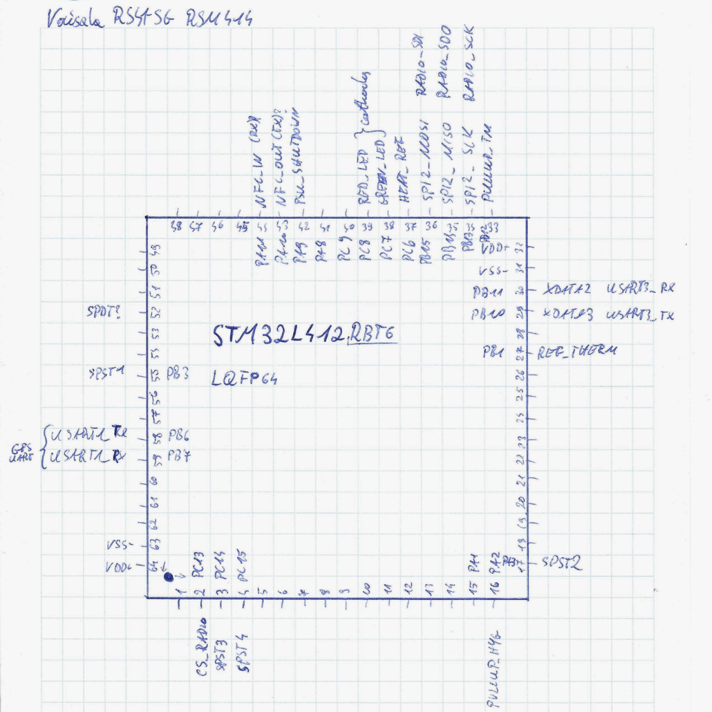

# RSM414 hardware
* [References](#references)
* [Older vs newer](#older-vs-newer---how-do-i-know-which-one-im-holding-now)
* [Key components](#key-components)
  * [Power supply](#power-supply)
    * [Boost converter](#boost-converter)
    * [LDOs](#ldos)
    * [Hard wired logic](#hard-wired-logic)
  * [Microcontroller](#microcontroller)
  * [Frontend](#frontend)
  * [GPS](#gps)
  * [Radio](#radio)
  * [Interfaces](#interfaces)
    * [SPI Flash](#spi-flash)
    * [XDATA Port](#xdata-port)
    * [Internal expansion connector](#internal-expansion-connector)
    * [NFC interface](#nfc-interface)
* [Final hardware words](#final-hardware-words)

## References!
This guide has references to the [radiosonde_hardware repo](https://github.com/bazjo/radiosonde_hardware/tree/master/Vaisala_RS41), and is partially based on it. **Huge thanks** to the author for providing the description.<br>
This page mainly mentions **differences** between old and new revisions, details can be found on the page above.<br>
The component naming also refers to this document, as well as some pin definitions.

## Older vs newer - how do I know which one I'm holding now?
Open the enclosure and take out the PCB. On the back side of it (the one without battery holder), in the middle of the coil on the bottom, there should be a PCB model, that starts with `RSM...`<br>
* PCB model with a **last digit of '4' or '5'** (or simply **`RSM4x4`** or **`RSM4x5`**)- newer (**after ~2023**) version (for example `RSM414`, `RSM424`, `RSM425`)
* PCB model with a **last digit of '1' or '2'**, (or simply **`RSM4x1`** or **`RSM4x2`**) - *older* version (for example `RSM412`, `RSM421` etc.)

`RSM4x1` and `RSM4x2` seem to be really similar and share the same design, the same goes for `RSM4x4` and `RSM4x5`. The first ones get called the old ones, and the `x4 x5` revisions are the new ones. **RS41-NFW project is compatible with all of them.**

<br>

This guide describes hardware used in the `RSM414` newer version of the sonde.


# Key components
**PCB - Front photo**
<p align="center">
<br>
</p><br>

**PCB - Rear photo**
<p align="center">
<br>
</p>


## Power Supply
### Boost converter
The boost converter - probably `TPS61200` from Texas Instruments, is used in a standard circuit. It gets enabled via `Q501` P-MOSFET. `Q501` state can be changed via hardwired logic to switch the sonde power.

### LDOs
The same as previous revision.

### Hard wired logic
It is exactly the same, though an accurate description maybe useful for somebody.<br>
Previously mentioned `Q501` P-MOSFET is controlled via a smaller N-MOSFET `Q502`. The sonde is ON if the `Q502` has a HIGH state on the gate, and it powers off when the gate closes.<br>

The sonde can be switched on via NFC 13.56MHz carrier signal on it's coil, which sends a rectified signal to the `Q502` gate.<br>

The button `S501` on the bottom of the sonde can turn on the sonde via `R507` to bring the `Q502` gate to logic HIGH signal. The button status can also be checked with uC via `R509`/`R513`_`C524` voltage divider. The middle leg of the button voltage divider is connected to the uC IO `PA6`. The button voltage gets slightly higher when it's pressed.<br>

The battery voltage can be measured by the MCU via `R508`/`R512`_`C523` voltage divider. The middle leg of this divider is connected to the `PA5` pin of the MCU. <br>

Once the `Q502` gets a HIGH signal, it stays open via `R505`, which sends voltage from the battery to the MOSFET gate.<br>

The sonde can be turned OFF by setting `PA9` MCU pin HIGH, which opens `Q503` N-MOSFET, that shorts the `Q502` gate directly to the ground. This closes the `Q501` and with that the boost converter EN and VIN pins don't receive power anymore.


## Microcontroller
<p align="center">
<br>
</p><br>

As you can already know, it is a new STMicroelectronics [**STM32L412RBT6**](https://eu.mouser.com/datasheet/2/389/stm32l412c8-1851177.pdf) in a LQFP64 package. <br>
Like the previous revision, many of the IOs have RC (resistor-capacitor) low pass filters. <br>
**NOTE:** This description is a little bit outdated, all pin definitions of both revisions are available in the firmware file.

## Frontend
It is very similar to the previous version, please refer to the *radiosonde_hardware* repo.<br>

## GPS
The GPS module in the new revision is the component that differs the most - this time it is a **uBlox M10050-KB** in a QFN28 package. The circuit around it seems like a standard implementation, with RF filters and probably an LNA chip, and standard coupling capacitors and RC low pass. <br>
The bad thing is that the only official document I could find about it was [this leaflet](https://content.u-blox.com/sites/default/files/UBX-M10050-KB_ProductSummary_UBX-20017986.pdf) which doesn't seem to be a complete datasheet. <br>
Luckily, the circuit implementation isn't hard to understand, so the UART pins were obvious to find. They are located on the right side of the chip, with RC filters before plated holes to the other side of the PCB, connected to pin 16 of the GPS as RX and 17 as a GPX TX. This GPS UART interface is then connected to the `PB6` and `PB7` pins of the uC.

## Radio
Nearly the same as in the previous rev.<br>

It is a Silicon Labs **Si4032**. It uses the same 26MHz clock as the GPS module, so the RF frequency on the output is different then the one set in the registers. <br>
`desired_freq * 26/30 = output_freq`<br>
The register values can be calculated on [this site](https://www.makemehack.com/2020/12/how-to-change-the-tx-frequency-of-the-vaisala-rs41-radiosonde.html), altough the frequency calulation algorithm is already implemented in the firmware.

## Interfaces
### SPI Flash
The SOIC8 SPI flash memory footprint is also available here like in the previous version, probably to be used with a military RS41-SGM edition, that features a Radio Silence Mode. More about it in the *radiosonde_hardware* document.

### XDATA Port
The XDATA port is the same on all models, with the following pinout (schematic is a copy from the mentioned repo):
```
Pinout of XDATA connector                                    Pinout of connected ribbon cable
                 -------                                     
           GND  | o   o |  XDATA_RX(PB11)                    > 1  GND
                |       |                                      2  XDATA_RX(PB11)
XDATA_TX(PB10)  | o   o |  +3V_MCU                             3  XDATA_TX(PB10) 
               -        |                                      4  +3V_MCU
       V_Boost|   o   o |  VBAT                                5  V_Boost
               -        |                                      6  VBAT
       MCU_RST  | o   o |  SWCLK(PA14)                         7  MCU_RST
                |       |                                      8  SWCLK(PA14)
   SWDIO(PA13)  | o   o |  GND                                 9  SWDIO(PA13)
                 -------                                      10  GND
```

### Internal expansion connector
In the new revisions, connector pinout is left the same, desciription can be found in the *radiosonde_hardware*. The pressure sensor (`RPM411` module) is the only known one to use it, and has only one revision, wihtout changes over time, so far.

### NFC interface
Besides the lack of the `C604` capacitor (but the footprint is still there?) the circuit looks the same as the one before. <br>
I had no luck for now to implement some decent protocol, because the board doesn't feature any NFC frontend (which means carrier OOK modulation for rx by the sonde and rfid load changing as a tx from sonde).<br>

The only thing that it is capable for now (via the hardware side) is that the sonde can be instantly turned ON on detection of the 13.56MHz RFID carrier. You can try this with your NFC-capable smartphone - just turn on the NFC function (the one for the RFID cards) and stick the back of your phone to the back of the sonde or somewhere near the coil on the bottom. The lights should turn ON and the sonde should start working.


## Final hardware words
If you didn't find an answer for your question about the sonde hardware in this text, please visit the previously mentioned *radiosonde_hardware*, which provides more detailed descriptions of some components.<br>
Feel free to ask in the issues here about any features :)

[def]: #power-supply
